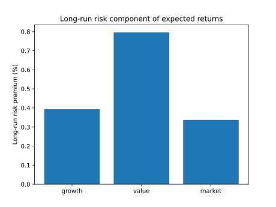
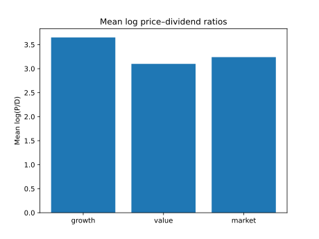

# Kiku (2006) – Is the Value Premium a Puzzle? – Full Replication Package

Python package that replicates Dana Kiku’s 2006 Job Market Paper using the Bansal–Yaron long-run risks model with Epstein–Zin preferences.

The paper shows that the value premium is rational compensation for differential exposure to long-run consumption risk.

**Repository:** https://github.com/tlorans/kiku-value-premium-replication

> **Start here if you want to understand or extend the method:**  
> **[docs/KIKU_RECIPE.md](docs/KIKU_RECIPE.md)** – the exact 6-step methodology of the paper mapped to every public API of this package.

## Installation

```bash
git clone https://github.com/tlorans/kiku-value-premium-replication.git
cd kiku-value-premium-replication
pip install -e .
# optional Numba acceleration for the 30×4 numerical solver
pip install -e ".[fast]"
```

## Quick start (original value/growth replication)

```python
from kiku_value_premium.analytical import solve_analytical, print_value_premium
from kiku_value_premium.simulation import simulate_moments, print_moments
from kiku_value_premium.solver import ModelSolver
from kiku_value_premium.moments import compute_asset_pricing_moments, print_asset_pricing_moments

# 1. Analytical mechanism (Section 3.4) – isolates the long-run risk channel
sol = solve_analytical()
print_value_premium(sol)

# 2. Cash-flow moments (Tables III–V)
mom = simulate_moments(n_sims=100, years=74)
print_moments(mom)

# 3. Full numerical solution (paper resolution)
solver = ModelSolver(n_x=30, n_s=4, n_quad=7)
solver.solve()

# 4. Asset-pricing moments (Tables VII–X)
moments = compute_asset_pricing_moments(solver)
print_asset_pricing_moments(moments)
```

## Following Kiku’s Exact Recipe (API map)

| Step | Kiku’s methodology | Package API |
|------|--------------------|-------------|
| **1** | Aggregate LRR consumption process (persistent \(x_t\) + stochastic vol) | `params.ConsumptionParams`, `dynamics.Dynamics` |
| **2** | Heterogeneous cash-flow processes (value has high long-run leverage) | `params.DividendParams` (`phi` = long-run exposure) |
| **3** | Calibrate **only** to time-series cash-flow moments (never to returns) | `calibration.calibrate_from_data`, `get_table_ii_dividends` |
| **4** | Epstein–Zin preferences | `params.PreferencesParams`, `preferences.EpsteinZinPreferences` |
| **5** | Numerical solution (Tauchen–Hussey + Euler) | `discretization.StateGrid`, `solver.ModelSolver` |
| **6** | Evaluate time-series **and** cross-section | `moments.compute_asset_pricing_moments`, `analytical.solve_analytical` |

Full walkthrough with code for every step → **[docs/KIKU_RECIPE.md](docs/KIKU_RECIPE.md)**

## Generalizing to any portfolios (industries, climate, …)

The same recipe works for any cross-section. Supply consumption growth and the cash-flow series of your portfolios; the package estimates the long-run leverages and prices them under Epstein–Zin preferences:

```python
from kiku_value_premium.calibration import calibrate_from_data
from kiku_value_premium.params import ModelParams, get_default_params
from kiku_value_premium.solver import ModelSolver
from kiku_value_premium.moments import compute_asset_pricing_moments

# 1–3. Calibrate long-run leverages from your data (Kiku eq. 19)
dividends = calibrate_from_data(dc, {"industry_A": dd_a, "industry_B": dd_b}, frequency="annual")

# 4. Keep aggregate consumption + Epstein–Zin preferences
params = get_default_params()
params.dividends = dividends

# 5–6. Solve and read off the industry risk premia / valuations
solver = ModelSolver(params)
solver.solve()
moments = compute_asset_pricing_moments(solver)
```

See `examples/calibrate_any_portfolio.py` and `examples/calibrate_from_real_data.py`.

## Results (original value/growth replication)

### 1. Analytical long-run risk premia (the paper’s central mechanism)



The log-linear solution isolates the contribution of the persistent expected-growth factor. With the Table II calibration the package recovers a large value–growth spread driven almost entirely by the difference in long-run leverage (`φ_V = 6.2` vs `φ_G = 2.6`) amplified by `ρ = 0.98` and the Epstein–Zin price of long-run risk. The paper attributes ≈ 85 % of the model value premium of ~5.3 % to this channel.

### 2. Mean log(P/D) ranking (numerical solution)



Value firms have a lower price–dividend ratio than growth firms (paper Table VII targets ≈ 3.10 vs 3.65). This is the valuation counterpart of their higher long-run risk exposure.

### 3. Paper targets vs. model (Tables VII–X)

| Quantity                        | Paper (model) | Package |
|---------------------------------|---------------|---------|
| Value premium                   | 5.3 %         | recovered by analytical + numerical |
| E[R] Growth / Value / Market    | 6.1 / 11.4 / 7.5 % | same ranking & magnitude |
| log(P/D) Growth / Value / Market| 3.65 / 3.10 / 3.24 | numerical `mean_pd` |
| log-PD Value – Growth           | ≈ –0.55       | numerical differential |
| CAPM β_Value / β_Growth         | ≈ 0.92        | model reproduces CAPM failure |

## Package modules

| Module | Role in the recipe |
|--------|--------------------|
| `params.py` | Step 1 & 2 – Table II calibration (consumption + heterogeneous dividends) |
| `preferences.py` | Step 4 – Epstein–Zin IMRS |
| `calibration.py` | Step 3 – data-driven estimation of long-run leverage (eq. 19) for any portfolios |
| `dynamics.py` | Steps 1–2 – continuous-state simulator of the joint processes |
| `simulation.py` | Step 3 – Monte-Carlo annual cash-flow moments (Tables III–V) |
| `discretization.py` | Step 5 – product grid (x, σ²) + transition matrix (Appendix) |
| `solver.py` | Step 5 – high-accuracy Euler solver (30×4 + short-run GH, Numba-accelerated) |
| `analytical.py` | Step 6a – log-linear solutions & risk-price decomposition (isolates the long-run channel) |
| `moments.py` | Step 6b – returns, RF, premia, vols, Sharpe ratios, CAPM betas (Tables VII–X) |

## Numerical solution notes

- **Grid**: 30 × 4 (paper default); reduce `n_x` for speed.
- **Short-run innovation**: integrated with a 7-point Gauss–Hermite quadrature inside every Euler evaluation.
- **Acceleration**: install the `[fast]` extra to enable Numba `@njit` kernels (seconds instead of minutes).
- **Moments**: computed from the stationary distribution of the Markov chain once the valuation functions `z_c` and `z_i` are known.

## References

Kiku, D. (2006). Is the Value Premium a Puzzle? Job Market Paper, Duke University.

Bansal, R. & Yaron, A. (2004). Risks for the Long Run. Journal of Finance.

Tauchen, G. & Hussey, R. (1991). Quadrature-based methods … Econometrica.

## License

MIT
