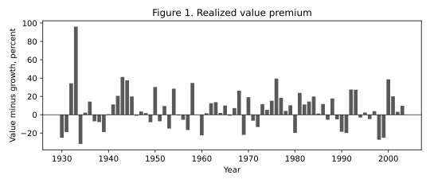

# Value versus growth
{: .no_toc }

1. TOC
{:toc}

**Question.** Why do value firms — highly exposed, in the data, to long-run consumption shocks — exhibit both higher ex-ante risk premia *and* lower price–dividend ratios than growth firms, whose cash flows are driven more by short-lived fluctuations in consumption?

The household is the same as on the market page: time-non-separable Epstein–Zin preferences, so the MRS depends on the forward-looking return on the aggregate wealth portfolio. Firms are distinguished by the exposure of their dividends to low- versus high-frequency consumption shocks. Valuations and risk premia then depend on the amount of low-frequency risks embodied in each claim’s cash flows.

The last page was the aggregate claim. This page is two firms in the same general equilibrium. Kiku (2006) is the worked example. The six-percent gap in average returns, and the ranking of valuations, are facts to be explained. They are not numbers you feed the calibrator. Run the chunks **in order**; they reuse `dc`, `panel`, and `ma` from the top.

```python
import numpy as np
import pandas as pd
import polars as pl
import plotnine as p9
import lrrcs as lrr

dc = pl.read_csv("data/consumption_annual.csv").sort("year")
panel = pl.read_csv("data/annual_panel.csv")
y = dc["dc"].to_numpy()
```

## Data

Each June, sort ordinary shares on NYSE, AMEX, and NASDAQ by book-to-market, using NYSE cutoffs (Fama and French 1993). Growth is the bottom fifth. Value is the top fifth. Dividends are Campbell–Shiller from `ret` versus `retx`, as in [Financial data]({{ '/financial-data.html' | relative_url }}). Sample: 1930–2003.

```python
wide = panel.pivot(index="year", on="claim", values="ret")
wide.head()
{c: round(float(panel.filter(pl.col("claim") == c)["ret"].mean() * 100), 2)
 for c in ("Growth", "Value", "Market")}
```

```text
{'Growth': 7.49, 'Value': 13.67, 'Market': 8.52}
```

Kiku’s printed sample (slightly different CRSP vintage) is 7.81 / 13.88 / 8.56. The gap is about six percent either way. Value is also cheaper: a lower valuation alongside a higher risk premium. CAPM betas sit near one, so neither the premium nor the valuation gap is a market-beta fact. Compute those betas on this file: OLS of each claim’s return on the market return.

```python
rm = panel.filter(pl.col("claim") == "Market").sort("year")["ret"].to_numpy()
rm_d = rm - rm.mean()

def capm_beta(claim):
    r = panel.filter(pl.col("claim") == claim).sort("year")["ret"].to_numpy()
    r_d = r - r.mean()
    return float(np.dot(rm_d, r_d) / np.dot(rm_d, rm_d))

{c: round(capm_beta(c), 2) for c in ("Growth", "Value")}
```

```text
{'Growth': 0.95, 'Value': 1.28}
```

Value’s beta is a bit above one on this reconstruction, not enough to explain six percent. The paper’s vintage has both near 1.03.

|  | E[R] % | σ(R) % | E[log P/D] |
|:---|---:|---:|---:|
| Growth | 7.81 (1.98) | 20.2 | 3.61 (0.18) |
| Value | 13.88 (1.74) | 29.9 | 3.25 (0.12) |
| Market | 8.56 (1.79) | 20.1 | 3.34 (0.13) |

```python
print(lrr.table_i(panel.to_pandas() if hasattr(panel, "to_pandas") else panel))
```



<p class="caption">Figure 1. Realized value minus growth, 1930–2003. The bars are positive in most years.</p>

## Calibrate cash flows

The household and the consumption process stay those of [the market]({{ '/time-series.html' | relative_url }}). Each claim differs only in four cash-flow numbers: mean dividend growth $$\mu$$, monthly loading $$\phi$$ on $$x_t$$, residual scale $$\varphi$$, and short-run correlation $$\alpha$$.

Equation (19) is OLS of dividend growth on a two-year MA of lagged consumption. No return on the right-hand side.

```python
ma = np.full(len(y), np.nan)
for t in range(2, len(y)):
    ma[t] = float(np.mean(y[t - 2 : t]))

def phi_hat(claim):
    dd = (
        panel.filter(pl.col("claim") == claim)
        .join(dc, on="year")
        .sort("year")["dgrowth"]
        .to_numpy()
    )
    mask = np.isfinite(ma) & np.isfinite(dd)
    x = ma[mask] - ma[mask].mean()
    e = dd[mask] - dd[mask].mean()
    return float(np.dot(x, e) / np.dot(x, x))

{c: round(phi_hat(c), 3) for c in ("Growth", "Value", "Market")}
```

```text
{'Growth': -0.267, 'Value': 12.129, 'Market': 0.722}
```

The ranking is the check: value firms are highly exposed to long-run consumption shocks; growth firms less so (Kiku’s Table VI prints $$-0.38$$ / $$2.16$$ / $$0.66$$, same order). The solver wants monthly $$\phi$$. Table II: $$\phi_{\text{value}}=6.2$$, $$\phi_{\text{growth}}=2.6$$, $$\phi_{\text{market}}=2.8$$. Value gets the larger $$\phi$$ because its cash flows load more on the persistent growth-rate component, not because it had a larger average return.

```python
def dd(claim):
    return (
        panel.filter(pl.col("claim") == claim)
        .join(dc, on="year")
        .sort("year")["dgrowth"]
        .to_numpy()
    )

div = lrr.calibrate_from_data(
    y,
    frequency="annual",
    window=2,
    long=dd("Value"),
    short=dd("Growth"),
    market=dd("Market"),
)
lrr.print_calibration_summary(div)
params = lrr.get_table_ii_params()
params.dividends["value"].phi, params.dividends["growth"].phi
```

```text
(6.2, 2.6)
```

There is no argument for returns.

## Solve

Same preferences as the market pass. Elasticity of log $$P/D$$ to $$x_t$$ is $$A_1=(\phi-1/\psi)/(1-\kappa_1\rho)$$. With Table II’s monthly $$\phi$$:

```python
psi, rho = 1.5, 0.98
for name, phi, zbar in (("growth", 2.6, 3.65), ("value", 6.2, 3.10)):
    kappa1 = np.exp(zbar) / (1.0 + np.exp(zbar))
    A1 = (phi - 1.0 / psi) / (1.0 - kappa1 * rho)
    print(name, round(A1, 1))
```

```text
growth 43.1
value  88.9
```

Value firms exhibit higher elasticity of their price–dividend ratios to long-run consumption news, and have to provide investors with high ex-ante compensation. `solve_analytical` and `ModelSolver` resolve either pair. The market key remains the time-series check that the same equilibrium still prices the aggregate claim.

```python
sol = lrr.solve_analytical(params)
lrr.print_long_short_premium(sol)
```

```text
Approximate annualized long-run risk premia:
  growth  :   0.39%
  value   :   0.80%
  market  :   0.34%
Value-growth spread from long-run risks: 0.40%
A1 (PD elasticity to x): growth=43.1, value=88.9
Price of long-run risk Lambda_eps = 5.95
```

The 0.40 percent is only the long-run *piece*. The full Euler-equation gap is larger.

## Compare pricing moments

With those four numbers locked, what **valuations and risk premia** does the general equilibrium assign?

|  | E[R] % data | E[R] % model | E[pd] data | E[pd] model |
|:---|---:|---:|---:|---:|
| Growth | 7.81 (1.98) | 6.07 (2.91) | 3.61 (0.18) | 3.65 (0.06) |
| Value | 13.88 (1.74) | 11.36 (4.30) | 3.25 (0.12) | 3.10 (0.15) |
| Market | 8.56 (1.79) | 7.53 (2.69) | 3.34 (0.13) | 3.24 (0.07) |
| Risk-free | 0.91 (0.39) | 1.58 (0.01) |  |  |

The model gap is about 5.3 percent against about 6 percent in the data. Mean price–dividend levels are about 24.7 on value versus 39.8 on growth. Value is both the high-premium claim and the low-valuation claim — risk premia and asset prices together. The market row is the time-series check that the same equilibrium still prices the aggregate claim.

Do not confuse $$\phi$$ with a CAPM beta. The model’s ratio of value to growth CAPM betas is 0.92. Value’s market beta is *lower*, as in the paper’s vintage. The priced risk is the amount of low-frequency consumption risk embodied in cash flows.

Failure would be: value’s risk premium sits below growth’s; value’s price–dividend ratio sits above growth’s; or value’s CAPM beta is much larger, so covariance with the market would have been enough.

```python
print("A1 value / A1 growth", round(sol.A1["value"] / sol.A1["growth"], 2))
```

```text
A1 value / A1 growth 2.06
```


<p class="caption">Analytical long-run premia. The gap is $$\phi_V=6.2$$ versus $$\phi_G=2.6$$, scaled by $$\rho=0.98$$ and the Epstein–Zin price of long-run news.</p>

## Key takeaways

- The six-percent premium and the cheaper valuation of value are facts, not calibration targets.
- The same household prices both legs: time-non-separable Epstein–Zin preferences, so the MRS depends on the forward-looking return on the aggregate wealth portfolio.
- Value firms are highly exposed to long-run consumption shocks; growth firms are driven more by short-lived fluctuations. That cash-flow ranking, not CAPM beta, is the mechanism.
- Value firms exhibit higher elasticity of their price–dividend ratios to long-run consumption news, and have to provide investors with high ex-ante compensation.
- Valuations and risk premia depend on the amount of low-frequency risks embodied in cash flows.
- The same general equilibrium still prices the market. That is the time-series check.
