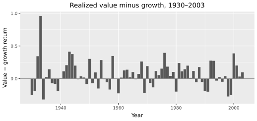
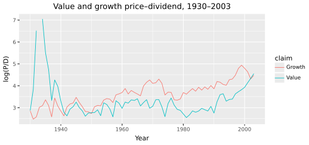

# Value versus growth
{: .no_toc }

1. TOC
{:toc}

Nothing about the household changes. Same preferences, same consumption process, same Euler equation as [Does the market still fit?]({{ '/time-series.html' | relative_url }}). A model that needed a new discount rate for every asset class would just be DCF with extra steps.

Value stocks have out-earned growth stocks by about six percentage points a year over this sample. Calling them cheap restates the fact. Calling them high-beta is false, because their market betas sit near one. An equilibrium answer must name the *risk* the extra return pays for, measure that risk somewhere other than in the returns themselves, and then deliver both facts at once, the higher premium *and* the lower price-dividend ratio.

Each claim brings only its cash-flow numbers. Value's dividends are levered to long-run consumption news far harder than growth's. The six-percent gap and value's cheaper valuation are facts to explain, not numbers you feed the calibrator. Average returns never enter the cash-flow step.

We use the following packages. Run the chunks **in order**: later snippets reuse `dc`, `panel`, and `y`.

```python
import numpy as np
import pandas as pd
import polars as pl
import plotnine as p9
import lrrcs as lrr

dc = pl.read_csv("data/consumption_annual.csv").sort("year")
panel = pl.read_csv("data/annual_panel.csv")
y = dc["dc"].to_numpy()
```

## Preparing the sample

[Financial data]({{ '/financial-data.html' | relative_url }}) already formed June book-to-market quintiles of ordinary shares, NYSE breakpoints (Fama and French 1993). Growth is the bottom fifth. Value is the top fifth. Dividends are Campbell-Shiller from `ret` versus `retx`. Sample: 1930 to 2003. We do not rebuild the sort.

```python
wide = panel.pivot(index="year", on="claim", values="ret")
wide.head()
{c: round(float(panel.filter(pl.col("claim") == c)["ret"].mean() * 100), 2)
 for c in ("Growth", "Value", "Market")}
```

```text
{'Growth': 7.49, 'Value': 13.67, 'Market': 8.52}
```

A note on vintages, once: our reconstruction prints 7.49 / 13.67 / 8.52, while Kiku's sample (a slightly different CRSP vintage) prints 7.81 / 13.88 / 8.56. Whenever a data column below shows her numbers, that is why. The gap is about six percent either way, and value is also *cheaper*: a lower valuation alongside a higher risk premium. Both facts, together, are the target.

|  | E[R] % | σ(R) % | Mean log P/D |
|:---|---:|---:|---:|
| Growth | 7.81 (1.98) | 20.2 | 3.61 (0.18) |
| Value | 13.88 (1.74) | 29.9 | 3.25 (0.12) |
| Market | 8.56 (1.79) | 20.1 | 3.34 (0.13) |

```python
print(lrr.table_i(panel.to_pandas() if hasattr(panel, "to_pandas") else panel))
```

The realized spread is positive in most years. Value's \(\log P/D\) sits below growth's throughout the sample.

```python
spread = (
    wide.with_columns((pl.col("Value") - pl.col("Growth")).alias("spread"))
    .select("year", "spread")
)
(
    p9.ggplot(spread.to_pandas(), p9.aes("year", "spread"))
    + p9.geom_col()
    + p9.geom_hline(yintercept=0, color="#888888")
    + p9.labs(x="Year", y="Value − growth return", title="Realized value minus growth")
)
vg = panel.filter(pl.col("claim").is_in(["Growth", "Value"]))
(
    p9.ggplot(
        vg.with_columns(pl.col("pd").log().alias("log_pd")).to_pandas(),
        p9.aes("year", "log_pd", color="claim"),
    )
    + p9.geom_line()
    + p9.labs(x="Year", y="log(P/D)", title="Value and growth price–dividend")
)
```



<p class="caption">Realized value minus growth, 1930 to 2003. The bars are positive in most years.</p>



<p class="caption">Value's $$\log(P/D)$$ sits below growth's. Both the premium and the cheaper valuation are facts to explain.</p>

Before reaching for anything exotic, kill the obvious story. The CAPM says premia line up with beta — the slope of a claim's return on the market's return. If value simply had a much larger beta, that would settle it and this book would be short. Run the regression:

```python
rm = panel.filter(pl.col("claim") == "Market").sort("year")["ret"].to_numpy()
rm_d = rm - rm.mean()

def capm_beta(claim):
    r = panel.filter(pl.col("claim") == claim).sort("year")["ret"].to_numpy()
    r_d = r - r.mean()
    return float(np.dot(rm_d, r_d) / np.dot(rm_d, rm_d))

{c: round(capm_beta(c), 2) for c in ("Growth", "Value")}
```

```text
{'Growth': 0.95, 'Value': 1.28}
```

Value's beta is a bit above one on this reconstruction (nowhere near enough to explain six percent) and the paper's vintage has both near 1.03. The premium is not a market-beta fact. So what risk is it?

## The loadings are already measured

The household and the consumption process stay those of [Does the market still fit?]({{ '/time-series.html' | relative_url }}). The annual slopes were already estimated in [Measuring leverage]({{ '/measuring-leverage.html' | relative_url }}). Recompute them if the page must stand alone. There is no argument for returns.

```python
ma = lrr.expected_growth_proxy(y, window=2)

def phi_hat(claim):
    dd = (
        panel.filter(pl.col("claim") == claim)
        .join(dc, on="year")
        .sort("year")["dgrowth"]
        .to_numpy()
    )
    mask = np.isfinite(ma) & np.isfinite(dd)
    x = ma[mask] - ma[mask].mean()
    e = dd[mask] - dd[mask].mean()
    return float(np.dot(x, e) / np.dot(x, x))

{c: round(phi_hat(c), 3) for c in ("Growth", "Value", "Market")}
```

```text
{'Growth': -0.267, 'Value': 12.129, 'Market': 0.722}
```

Kiku's Table VI prints $$-0.38$$ / $$2.16$$ / $$0.66$$. Value $$\gg$$ growth survives. The growth point estimate does not.

```python
plot_df = (
    panel.filter(pl.col("claim").is_in(["Growth", "Value"]))
    .join(dc.with_columns(pl.Series("ma", ma)).select("year", "ma"), on="year")
    .filter(pl.col("ma").is_finite() & pl.col("dgrowth").is_finite())
)
(
    p9.ggplot(plot_df.to_pandas(), p9.aes("ma", "dgrowth", color="claim"))
    + p9.geom_point()
    + p9.labs(
        x="Two-year MA of lagged Δc",
        y="Δd",
        title="Cash-flow exposure, not returns",
    )
)
```


<p class="caption">Value and growth dividend growth against the two-year moving average of lagged consumption growth. Value's slope is steeper. Average returns never entered.</p>

```python
def dd(claim):
    return (
        panel.filter(pl.col("claim") == claim)
        .join(dc, on="year")
        .sort("year")["dgrowth"]
        .to_numpy()
    )

div = lrr.calibrate_from_data(
    y,
    frequency="annual",
    window=2,
    long=dd("Value"),
    short=dd("Growth"),
    market=dd("Market"),
)
lrr.print_calibration_summary(div)
params = lrr.get_table_ii_params()
params.dividends["value"].phi, params.dividends["growth"].phi
```

```text
(6.2, 2.6)
```

## Elasticity of price–dividend to x_t

Same preferences as the market chapter, nothing re-tuned. The Euler equation and the IMRS are those of [the long-run risks model]({{ '/long-run-risks-model.html' | relative_url }}). The elasticity of log $$P/D$$ to $$x_t$$ is $$A_1=(\phi-1/\psi)/(1-\kappa_1\rho)$$, and only $$\phi$$ differs across claims.

```python
psi, rho = 1.5, 0.98
for name, phi, zbar in (("growth", 2.6, 3.65), ("value", 6.2, 3.10)):
    kappa1 = np.exp(zbar) / (1.0 + np.exp(zbar))
    A1 = (phi - 1.0 / psi) / (1.0 - kappa1 * rho)
    print(name, round(A1, 1))
```

```text
growth 43.1
value  88.9
```

One gap in cash-flow leverage, two consequences. Value's price-dividend ratio is about twice as elastic to long-run consumption news. The premium and the cheap valuation are one fact seen from two sides.

## Solve and check rankings

```python
sol = lrr.solve_analytical(params)
lrr.print_long_short_premium(sol)
```

```text
Approximate annualized long-run risk premia:
  growth  :   0.39%
  value   :   0.80%
  market  :   0.34%
Value-growth spread from long-run risks: 0.40%
A1 (PD elasticity to x): growth=43.1, value=88.9
Price of long-run risk Lambda_eps = 5.95
```

The 0.40 percent is only the long-run *piece*. `lrr.compute_asset_pricing_moments` integrates the Euler equation on a grid. Kiku's Table VII (1000 samples) is the comparison. A match on the premium with the wrong price-dividend ranking is a fail.

|  | E[R] % data | E[R] % model | Mean log P/D data | Mean log P/D model |
|:---|---:|---:|---:|---:|
| Growth | 7.81 (1.98) | 6.07 (2.91) | 3.61 (0.18) | 3.65 (0.06) |
| Value | 13.88 (1.74) | 11.36 (4.30) | 3.25 (0.12) | 3.10 (0.15) |
| Market | 8.56 (1.79) | 7.53 (2.69) | 3.34 (0.13) | 3.24 (0.07) |
| Risk-free | 0.91 (0.39) | 1.58 (0.01) |  |  |

The model gap is about 5.3 percent against about 6 in the data. The model's ratio of value to growth CAPM betas is 0.92, value's market beta is *lower* while its premium is five points higher.

Equalize the only cross-sectional input and the ranking has to die.

```python
params.dividends["value"].phi = 2.6
params.dividends["growth"].phi = 2.6
lrr.print_long_short_premium(lrr.solve_analytical(params))
```

```text
Approximate annualized long-run risk premia:
  growth  :   0.39%
  value   :   0.39%
  market  :   0.34%
Value-growth spread from long-run risks: 0.00%
```

Nothing about the household changed.

```python
print("A1 value / A1 growth", round(sol.A1["value"] / sol.A1["growth"], 2))
```

```text
A1 value / A1 growth 2.06
```


<p class="caption">Analytical long-run premia. The gap is $$\phi_V=6.2$$ versus $$\phi_G=2.6$$.</p>

## Key takeaways

- The six-percent premium and value's cheaper valuation are facts to explain, not calibration targets.
- Nothing about the household changes across assets.
- The ranking is the check: value loads hard on long-run consumption news, growth barely at all.
- Equalize $$\phi$$ and the ranking disappears.
- The model reproduces the CAPM anomaly itself, value's model beta is lower (ratio 0.92) while its premium is higher.

## Exercises

1. Drop 1930 to 1945 from the OLS. Does value still have the larger $$\tilde\phi$$?
2. Using the model's $$A_1$$ ratio 2.06, what $$\phi_{\text{value}}$$ would you need if $$\phi_{\text{growth}}$$ stayed 2.6 and you wanted the two elasticities equal?
3. Set $$\psi=1/\gamma$$ and re-solve. Does the value-growth ranking in $$A_1$$ survive?
