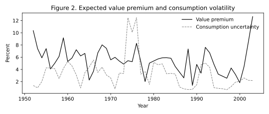
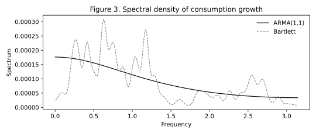
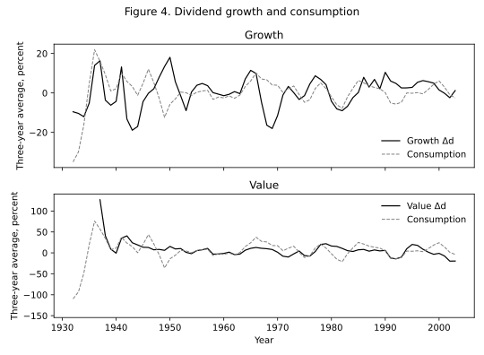

# Section 2 – Empirical Evidence

## What she does

Kiku’s sample is **1930–2003**. She forms five book-to-market quintiles at the end of June each year, NYSE breakpoints, NYSE/AMEX/NASDAQ ordinary shares. Growth is the bottom quintile, value the top. Market is the CRSP value-weighted market.

Book-to-market is book equity at the last fiscal year-end of the prior calendar year over December market equity of the prior year. Pre-1962 book equity comes from the Davis–Fama–French / Ken French historical book-equity file because Compustat does not go back to 1930.

Per-share dividends follow Campbell–Shiller (1988) / Bansal–Dittmar–Lundblad (2005): extract the yield from with-dividend versus without-dividend returns, \(D_{t+1}=y_{t+1}V_t\), \(V_{t+1}=h_{t+1}V_t\), \(V_0=100\). Monthly returns and dividends are time-aggregated to calendar years and converted to real with the PCE deflator. Dividend growth is the first difference of log dividends. \(\log(P/D)\) is end-of-year price over that year’s cumulative dividend.

Consumption is real per-capita nondurables plus services. The real risk-free rate is the 90-day T-bill minus a 12-month moving average of inflation.

Table I uses Newey–West **8** lags (returns and growth in percent; \(\log(P/D)\) in logs). Table VI data-column standard errors use Newey–West **4** lags. Figure 2 is sliced **1952–2003**, as in her caption.

## What you call

```python
from kiku_value_premium.empirical import START, END
from kiku_value_premium.empirical.panel import build_annual_panel
from kiku_value_premium.empirical.tables import table_i, table_vi_data
from kiku_value_premium.empirical.figures import figure1, figure2, figure3, figure4
import pandas as pd

bm = build_annual_panel(refresh=False)   # reuse data/raw/ when present
print(table_i(bm, START, END))

dc = pd.read_csv("data/consumption_annual.csv").set_index("year")["dc"]
print(table_vi_data(bm, dc, START, END))

figure1(bm, "docs/figures/figure1.svg")
figure2(bm, dc, "docs/figures/figure2.svg")
figure3(dc, "docs/figures/figure3.svg")
figure4(bm, dc, "docs/figures/figure4.svg")
```

`START, END = 1930, 2003`. `build_annual_panel(refresh=True)` hits WRDS again. CI never calls WRDS; committed `data/annual_panel.csv` is enough for the tables.

## What you should see

Table I returns, \(\log(P/D)\), return correlations, and Table III consumption sit inside her printed Newey–West bands. Four Value cash-flow cells — \(\sigma(\Delta d)\), the Value–Market \(\Delta d\) correlation, \(\tilde\phi\), and the innovation correlation — do not, because 1933 Value is a genuine zero-dividend year (CRSP `ret == retx` in every month). Those four cells are ranking/sign checks, not the hard SE gate. Printed goldens are unchanged.

### Table I Panel A (printed, NW 8 lags)

Percent except \(\log(P/D)\).

| Asset | E[R] | σ(R) | E[Δd] | σ(Δd) | E[log P/D] |
|-------|------|------|-------|-------|------------|
| Growth | 7.81 (1.98) | 20.2 (2.00) | 0.68 (1.25) | 13.9 (2.24) | 3.61 (0.18) |
| Value | 13.88 (1.74) | 29.9 (4.34) | 3.63 (3.06) | 18.1 (2.69) | 3.25 (0.12) |
| Market | 8.56 (1.79) | 20.1 (2.23) | 0.85 (0.95) | 10.9 (2.41) | 3.34 (0.13) |

### Table I Panel B (printed)

Return correlations: GV 0.75 (0.05), GM 0.95 (0.01), VM 0.87 (0.04).

Δd correlations: GV 0.32 (0.17), GM 0.80 (0.09), VM 0.53 (0.10).

### Table III consumption (printed)

E[Δc] 1.96 (0.32), σ 2.20 (0.45), AC1 0.44 (0.12), AC2 0.16 (0.15).

### Table VI data (printed, NW 4 lags)

\(\tilde\phi\): growth −0.38 (1.34), value 2.16 (1.44), market 0.66 (1.20).

Innovation correlations: growth 0.37 (0.14), value 0.30 (0.07), market 0.58 (0.15).

On the committed panel, Value \(\sigma(\Delta d)\) is about 47.7 versus her 18.1 (2.69); Value–Market Δd corr about 0.64 versus 0.53 (0.10); Value \(\tilde\phi\) about 12.1 versus 2.16 (1.44); Value innov_corr about 0.56 versus 0.30 (0.07). Ranking still holds: Value \(\sigma(\Delta d)\) > Growth, Value–Market Δd corr > 0, Value \(\tilde\phi\) > Growth, Value innov_corr > 0.


*Figure 1. Realized value minus growth, 1930–2003.*



*Figure 2. Expected value premium (spread projected on lagged P/D and dividend growth) versus the rescaled 3-year moving average of squared AR(1) consumption residuals, 1952–2003.*



*Figure 3. Spectral density of consumption growth, ARMA(1,1) versus Bartlett kernel, 1930–2003.*



*Figure 4. 3-year moving average of dividend growth versus rescaled consumption, growth and value panels, 1930–2003.*
