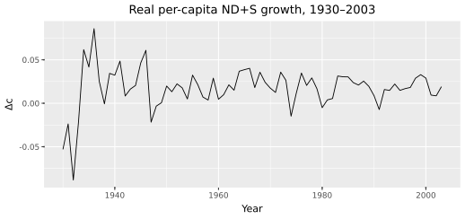
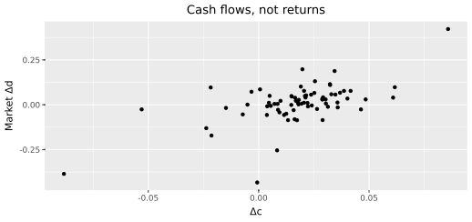
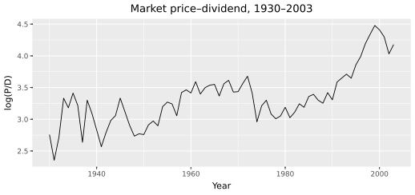

# Financial data
{: .no_toc }

1. TOC
{:toc}


**Hook.** Can you write down every series the Euler equation is allowed to see — without ever typing an average return?

**Naive take.** Feed the model CRSP returns, a Fama–French factor, and a trailing equity premium. Calibration then "explains" the premium it was given.

**Outcomes this page.**
- F — tag each series as cash-flow side, discount-rate side, or a fact to explain.
- Q — recover a year's dividend from `ret` minus `retx` on a twelve-month toy path.
- P — load `data/consumption_annual.csv`, `data/annual_panel.csv`, and `data/rf_annual.csv`, then plot $$\Delta c$$ and market $$\log(P/D)$$.


A model whose inputs cannot be measured is not a model; it is an opinion with equations. So before any Euler equation, this chapter builds every input from public records, and each series has a job. Consumption growth feeds *both* halves of the model — it is the endowment the household eats (the discount-rate side) and the trend that dividends are levered to (the cash-flow side). Dividends of the market, value, and growth claims are pure cash-flow-side objects. The real T-bill belongs to the discount-rate side: it pins the level against which every premium is measured. And the price–dividend ratios and average returns we tabulate at the end are neither — they are the *outputs* the equilibrium will be graded on. Average returns are a fact to explain, not an input; they enter nothing below.

The pricing chapters use 1930–2003 (Kiku 2006 / Bansal and Yaron 2004). Live FRED continues past 2003; after constructing we cut to that window. Run the chunks **in order**.

```python
import io
import zipfile
import urllib.request
import numpy as np
import pandas as pd
import polars as pl
import plotnine as p9
import tidyfinance as tf
import lrrcs as lrr

start, end = 1930, 2003
```

## Consumption

The representative agent consumes real per-capita *nondurables plus services*. Why not total consumption? Durables look more like investment (Hall; Mehra and Prescott; Bansal and Yaron): buying a car this year is not eating a car this year. We divide by population so headcount growth is not a consumption shock. This one series carries the whole model — the household's marginal utility and the trend in every claim's cash flows both run through it. The NIPA quantity indexes are on FRED — public, no credentials.

```python
def fred_annual(series_id: str) -> pl.DataFrame:
    url = f"https://fred.stlouisfed.org/graph/fredgraph.csv?id={series_id}"
    raw = pl.read_csv(url)
    return raw.with_columns(
        pl.col("observation_date").str.slice(0, 4).cast(pl.Int32).alias("year"),
        pl.col(series_id).alias("value"),
    ).select("year", "value")

nd = fred_annual("DNDGRA3A086NBEA").rename({"value": "nd"})
sv = fred_annual("DSERRA3A086NBEA").rename({"value": "sv"})
pop = fred_annual("B230RC0A052NBEA").rename({"value": "pop"})
nd.head(3)
```

```text
 year     nd
 1929  11.737
 1930  11.125
 1931  11.006
```

Join on year, form the per-capita level, then take log differences. That *is* consumption growth.

```python
levels = (
    nd.join(sv, on="year")
    .join(pop, on="year")
    .with_columns(((pl.col("nd") + pl.col("sv")) / pl.col("pop")).alias("c"))
    .with_columns(pl.col("c").log().diff().alias("dc"))
    .drop_nulls()
)
dc = levels.filter((pl.col("year") >= start) & (pl.col("year") <= end)).select("year", "dc")
dc.head()
print(dc["dc"].mean() * 100, dc["dc"].std() * 100, dc.height)
```

```text
 year     dc
 1930  -0.053
 1931  -0.024
 1932  -0.088
 1933  -0.021
 1934   0.062

1.75  2.37  74
```

1932 is the Depression trough: consumption falls almost nine percent. Mean growth 1930–2003 is 1.75 percent, volatility 2.37 percent, 74 years. Hold on to that volatility number — 2.37 percent. The equity premium puzzle is the claim that a series this smooth cannot scare anyone into demanding six extra points of return, and the model's answer is that the scary part is not the wiggles but the slow component hiding under them.

```python
(
    p9.ggplot(dc.to_pandas(), p9.aes("year", "dc"))
    + p9.geom_line()
    + p9.labs(x="Year", y="Δc", title="Real per-capita ND+S growth, 1930–2003")
)
```



<p class="caption">Annual log growth of real per-capita nondurables plus services, 1930–2003. The 1932 drop is the Depression, not a plotting glitch.</p>

If the three FRED series are already pandas with a year index, `lrr.consumption_growth_from_levels(nd, sv, pop)` is the log-difference step.

The same three FRED series and the same log difference:

```python
dc_pkg = lrr.load_consumption().loc[start:end]
dc_pkg.mean(), float(dc["dc"].mean())
```

CRSP prices and dividends are nominal. The PCE implicit price deflator (`DPCERD3A086NBEA`) converts them into consumption units — the household cares about real cash flows, so the cash-flow side needs it too. Download it the same way as the quantity indexes, or call `lrr.load_deflator()`.

```python
defl_pl = fred_annual("DPCERD3A086NBEA").rename({"value": "defl"})
defl = pd.Series(
    defl_pl["defl"].to_numpy(),
    index=defl_pl["year"].to_numpy(),
    name="defl",
)
defl.loc[start:end].head()
```

## Market dividends

Now the cash-flow side proper. Here is an inconvenient fact: CRSP stores *returns*, not a dividend file. The return with dividends is `ret`; the capital-gain return is `retx`. Campbell and Shiller (1988) recover the dividend as the gap, scaled by a cumulated price index $$V$$:

$$
D_t=(r_t-r_t^{x})\,V_{t-1},\qquad V_t=V_{t-1}(1+r_t^{x}).
$$

In words: whatever the with-dividend return earned beyond the price return, that was the dividend, paid on last month's value. The monthly CRSP file comes from WRDS; the `tidyfinance` package's `download_data` is one convenient client (any WRDS client works), and this identity needs `retx` and the 1925–2003 file (`version="v1"`):

```python
tf.set_wrds_credentials()
crsp = tf.download_data(
    domain="WRDS",
    dataset="crsp_monthly",
    start_date="1925-12-01",
    end_date="2003-12-31",
    version="v1",
    additional_columns=["retx"],
)
```

Ordinary shares, NYSE/AMEX/NASDAQ, and delisting (Fama–French −30% on performance codes 400–599, applied to `retx` as well as `ret`) live inside `lrr.build_annual_panel`. The identity itself does not need WRDS. Start $$V=100$$. Every month $$r^{x}=1\%$$ and $$r=1.2\%$$, so each dividend is 0.2 percent of the lagged price index. Compound for a year:

```python
dates = pd.date_range("2000-01-31", periods=12, freq="ME")
retx = pd.Series(0.01, index=dates)
ret = pd.Series(0.012, index=dates)

v = 100.0
rows = []
year_div, year_v, year_ret = {}, {}, {}
for dt in dates:
    d = (ret.loc[dt] - retx.loc[dt]) * v
    v = v * (1.0 + retx.loc[dt])
    y = int(dt.year)
    year_div[y] = year_div.get(y, 0.0) + max(d, 0.0)
    year_v[y] = v
    year_ret[y] = year_ret.get(y, 1.0) * (1.0 + ret.loc[dt])
pd.DataFrame(
    {"year": [2000], "div": [year_div[2000]], "v": [year_v[2000]],
     "pd": [year_v[2000] / year_div[2000]]}
)
```

```text
 year   div       v     pd
 2000  2.54  112.68  44.42
```

The price index compounds at 1% per month to 112.68. Year-end $$P/D$$ is 44.4. Deflate `div` and `v` by the PCE index, then take log differences of real dividends for $$\Delta d$$. `lrr.campbell_shiller_annual(ret, retx, defl)` is that loop plus deflation.

On CRSP, pass the value-weighted `ret` / `retx` of ordinary shares the same way. `lrr.build_annual_panel` does it for growth, value, and the market, and writes `data/annual_panel.csv`. `refresh=False` reuses `data/raw/*.parquet` when present.

```python
try:
    panel = lrr.build_annual_panel(refresh=False)
except Exception:
    panel = pd.read_csv("data/annual_panel.csv")
if not isinstance(panel, pl.DataFrame):
    panel = pl.from_pandas(panel)
mkt = panel.filter(pl.col("claim") == "Market").join(dc, on="year")
mkt.select("year", "ret", "dgrowth", "pd", "dc").head()
```

```python
(
    p9.ggplot(mkt.to_pandas(), p9.aes("dc", "dgrowth"))
    + p9.geom_point()
    + p9.labs(x="Δc", y="Market Δd", title="Cash flows, not returns")
)
(
    p9.ggplot(
        mkt.with_columns(pl.col("pd").log().alias("log_pd")).to_pandas(),
        p9.aes("year", "log_pd"),
    )
    + p9.geom_line()
    + p9.labs(x="Year", y="log(P/D)", title="Market price–dividend, 1930–2003")
)
```



<p class="caption">Market dividend growth against consumption growth. Both series are constructed (NIPA; Campbell–Shiller on CRSP). Average returns never entered.</p>



<p class="caption">Market $$\log(P/D)$$ from the same Campbell–Shiller price and dividend. The Euler equation has to match this later.</p>

## Real T-bill

The discount-rate side needs its anchor: the model's safe rate is a *real* T-bill, not a nominal `RF` series. CRSP `mcti` has the 90-day bill (`t90ret`) and a CPI index. Subtract a twelve-month moving average of log inflation, then average inside the year:

```python
idx = pd.date_range("2000-01-31", periods=24, freq="ME")
t90 = pd.Series(0.004, index=idx)
cpi = pd.Series(100.0 * (1.002 ** np.arange(24)), index=idx)
inflation = np.log(cpi / cpi.shift(1))
real_m = t90 - inflation.rolling(12).mean()
rf_toy = real_m.resample("YE").mean()
rf_toy
```

```text
2000-12-31    NaN
2001-12-31    0.002
```

The first year is missing because of the twelve-month inflation window. `lrr.real_rf_from_monthly(t90, cpi)` is that transformation. On CRSP, pass `mcti.t90ret` and `mcti.cpi`. `build_annual_panel` writes `data/rf_annual.csv`.

## Value, growth, and the panel

Finally, the cross section's cash flows. Value and growth are June book-to-market quintiles of ordinary shares, NYSE breakpoints (Fama and French 1993): growth is the bottom fifth, value the top. The sort needs book equity — Compustat (`seq`, `ceq`, preferred stock, deferred taxes) merged through CCM — and the whole point of sorting is to hand the model two claims whose *dividends* behave differently, so that any difference in prices and premia must be earned by cash-flow risk, not assumed.

Compustat is thin before the 1960s. Davis, Fama, and French backfill Moody's book equity. That file is public:

```python
url = "https://mba.tuck.dartmouth.edu/pages/faculty/ken.french/ftp/Historical_BE_Data.zip"
req = urllib.request.Request(url, headers={"User-Agent": "Mozilla/5.0"})
with urllib.request.urlopen(req, timeout=60) as resp:
    blob = resp.read()
with zipfile.ZipFile(io.BytesIO(blob)) as zf:
    text = zf.read(zf.namelist()[0]).decode("latin-1")
text.splitlines()[:4]
```

Each line is a `permno` and a vector of annual book-equity values starting in 1926. `lrr.build_annual_panel` parses it, splices it onto Compustat, forms the quintiles, value-weights, and runs Campbell–Shiller on growth (quintile 1), value (quintile 5), and the market.

```python
print(lrr.table_i(panel))
```

`refresh=True` hits WRDS and Ken French again.

| claim | E[R] % | σ(R) % | E[Δd] % | σ(Δd) % | E[log P/D] |
|:---|---:|---:|---:|---:|---:|
| Growth | 7.49 (1.93) | 20.02 | 0.33 (1.16) | 14.35 | 3.62 (0.17) |
| Value | 13.67 (1.63) | 29.67 | 3.53 (4.13) | 47.72 | 3.34 (0.19) |
| Market | 8.52 (1.75) | 20.10 | 0.92 (0.94) | 11.02 | 3.33 (0.13) |

Returns and dividend growth are percent per year, Newey–West standard errors in parentheses. Look at the middle columns before the first one. Value's dividend growth is wilder — a volatility of 48 percent against growth's 14 — and that is a *cash-flow* statement, constructed without a single average return. The return columns then record the facts to explain: value earned more *and* was cheaper. Higher risk premia and lower valuations, the two outputs of the general equilibrium, and neither entered the construction.

## Key takeaways

- Every input is measurable and public or WRDS-standard: NIPA consumption, CRSP returns, Compustat book equity, a Ken French zip for pre-1960 book equity.
- Consumption serves both halves of the model: the household's endowment (discount-rate side) and the trend dividends are levered to (cash-flow side). Its volatility — 2.37 percent — is why the premium is a puzzle.
- CRSP stores returns, so dividends are recovered by the Campbell–Shiller identity from `ret` minus `retx`. These are the cash flows in which low- versus high-frequency risks are embodied.
- The real T-bill anchors the discount-rate side; the value and growth quintiles hand the cross section its two cash-flow claims.
- The 1930–2003 files this pipeline writes (`data/consumption_annual.csv`, `data/annual_panel.csv`, `data/rf_annual.csv`) are the sample whose valuations and risk premia [The Time Series]({{ '/time-series.html' | relative_url }}) and [The Cross Section]({{ '/cross-section.html' | relative_url }}) have to match.

Next: [The long-run risks model]({{ '/long-run-risks-model.html' | relative_url }}).

## Pitfalls

- Finance — putting average returns, Sharpes, or CAPM betas on the cash-flow side.
- Finance — using total consumption (durables included) as the household's endowment.
- Quanti — mixing nominal CRSP dividends with real consumption without the PCE deflator.
- Python — a live FRED pull past 2003 is not the replica window. Cut to 1930–2003 before any moment.

## Exercises

1. Recompute mean and volatility of $$\Delta c$$ on 1950–2003 instead of 1930–2003. What happened to the "consumption is smooth" fact?
2. In the twelve-month toy Campbell–Shiller loop, change monthly $$r^x$$ from 1% to 0%. What is year-end $$P/D$$? Predict before you rerun.
3. Drop the PCE deflator and recompute market $$\Delta d$$ from nominal dividends. Which moments moved, and which side of the model did you just contaminate?
