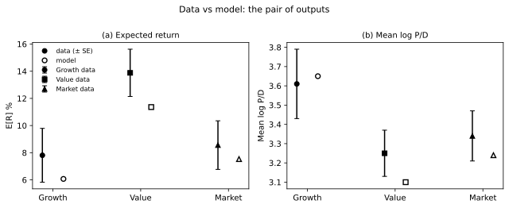

# The result
{: .no_toc }

1. TOC
{:toc}

You already know how to price a stock. Forecast the cash flows, pick a discount rate, divide. Every valuation you have ever built runs on those two numbers. The book shows where the two numbers come from, and why they are two outputs of one process rather than two free inputs.

Python 3.11+. Clone and `uv pip install -e .`. Nothing below needs credentials.

```bash
git clone https://github.com/tlorans/kiku-value-premium-replication.git
cd kiku-value-premium-replication
uv pip install -e .
```

```python
import numpy as np
import lrrcs as lrr

lrr.__version__
```

Extras and WRDS live on [Installation]({{ '/installation.html' | relative_url }}). Rebuilding the panel from the raw records is [Financial data]({{ '/financial-data.html' | relative_url }}), off the argument path.

## Two numbers you made up

Start with the workhorse. If dividends grow at a constant rate $$g$$ and you discount at a constant rate $$r$$, the price-dividend ratio is

$$\frac{P}{D} = \frac{1}{r - g}.$$

Everything interesting in asset pricing hides inside $$r-g$$. And the DCF is silent about both halves. Where did you get $$r$$? A CAPM regression, a corporate hurdle rate, or "eight percent seems reasonable." Where did you get $$g$$? Analyst forecasts, a historical average, a terminal-value convention. Nothing in the framework stops you from pairing any $$g$$ with any $$r$$.

The numbers are not innocent. At $$r-g = 4\%$$ the price-dividend ratio is 25. Shave the discount rate by one percentage point and the price jumps by a third. A third of the firm's value, riding on a number you made up.

Worse, the two numbers are not independent, and the DCF cannot see why. A firm whose cash flows collapse in bad times *should* carry a high discount rate, the discount rate is compensation for exactly the risk that sits in the cash flows. Choose the numerator and the denominator separately and you have assumed away the entire question: why do risky cash flows command high expected returns, and how high?

## One process instead

General equilibrium replaces the two free numbers with one measurable process: aggregate consumption.

Consumption growth, in this economy, is not white noise. It carries a small but highly persistent component $$x_t$$ (long-run risks) and its volatility moves over time. Two modelling decisions then split the DCF's job between them:

- **The cash-flow model.** Each asset's dividend growth loads on $$x_t$$ with a leverage coefficient $$\phi$$. That loading is *estimated* from consumption and dividend data. This is where $$g$$ comes from, not a constant you assume, but a process tied to the macroeconomy.
- **The discount-rate model.** A household with Epstein-Zin preferences owns every claim and fears news about long-run growth. Its marginal utility, driven by the *same* $$x_t$$, prices the cash flows. This is where $$r$$ comes from.

One shock to $$x_t$$ moves expected dividends for decades and moves marginal utility at the same instant. The comovement, not either piece alone, is the risk premium. Prices and premia stop being inputs and become outputs, and outputs can be wrong. The model is falsifiable, claim by claim, in both prices and premia. Average returns never enter the inputs.

## An economy in five lines

Kiku (2006, Table II) is the default economy: Epstein-Zin preferences, a persistent component $$x_t$$ in consumption growth, time-varying consumption volatility, and three dividend claims (growth, value, market) that differ *only* in how hard their cash flows load on $$x_t$$. The numbers are monthly.

```python
delta, gamma, psi = 0.999, 10.0, 1.5
theta = (1.0 - gamma) / (1.0 - 1.0 / psi)
mu_c, rho, phi_x, sigma = 0.0015, 0.98, 0.032, 0.0064
phi = {"growth": 2.6, "value": 6.2, "market": 2.8}
theta, rho, phi
```

```text
(-27.0, 0.98, {'growth': 2.6, 'value': 6.2, 'market': 2.8})
```

Look at what is *not* in the block. There are no expected returns, no risk premia, and no prices. Preferences ($$\delta,\gamma,\psi$$), a consumption process ($$\mu_c,\rho,\varphi_x,\sigma$$), and three cash-flow loadings. Value's dividends lever long-run consumption news at 6.2; growth's at 2.6. The dispersion in cash-flow risk, not the six-percent gap in average returns, is the only cross-sectional input the equilibrium gets.

$$\theta = -27$$ because Epstein-Zin preferences separate aversion to risk ($$\gamma = 10$$) from aversion to substitution over time ($$\psi = 1.5$$). Power utility welds those two together. The household's marginal rate of substitution then depends on consumption tomorrow and on the return on total wealth, which is news about the *entire future*. A small piece of bad news about $$x_t$$ lowers expected consumption for decades, and this household will pay dearly to avoid assets that fall on exactly that news.

Now solve the economy.

```python
params = lrr.get_table_ii_params()
params.prefs.gamma, params.cons.rho
params.dividends["value"].phi, params.dividends["growth"].phi
sol = lrr.solve_analytical(params)
lrr.print_long_short_premium(sol)
```

```text
Approximate annualized long-run risk premia:
  growth  :   0.39%
  value   :   0.80%
  market  :   0.34%
Value-growth spread from long-run risks: 0.40%
A1 (PD elasticity to x): growth=43.1, value=88.9
Price of long-run risk Lambda_eps = 5.95
```

**What that did.** It solved for prices and premia jointly. The premia line is the discount-rate model at work: one price of long-run risk, $$\Lambda_\epsilon = 5.95$$, times each claim's exposure. The $$A_1$$ line is the same solution read as a valuation statement: value's price-dividend ratio is more than twice as elastic to long-run news as growth's. One solve, both objects, the DCF's $$r$$ and $$g$$, fused.

**What that did not do.** It estimated nothing and matched nothing. The loadings were Kiku's, taken on faith. And the 0.40 percent is not the 5.3 percent in the table below. The 0.40 is only compensation for news about $$x_t$$. The 5.3 is the Euler equation on the whole claim, short-run shocks and volatility news included. Kiku's Table VII (1,000 samples) is the scoreboard, premia *and* valuations, together. A match on one with a miss on the other is a fail.

|  | E[R] % data | E[R] % model | Mean log P/D data | Mean log P/D model |
|:---|---:|---:|---:|---:|
| Growth | 7.81 (1.98) | 6.07 (2.91) | 3.61 (0.18) | 3.65 (0.06) |
| Value | 13.88 (1.74) | 11.36 (4.30) | 3.25 (0.12) | 3.10 (0.15) |
| Market | 8.56 (1.79) | 7.53 (2.69) | 3.34 (0.13) | 3.24 (0.07) |
| Risk-free | 0.91 (0.39) | 1.58 (0.01) |  |  |



<p class="caption">The Home table as a picture. Filled markers with bars: data (Kiku's printed Newey-West standard errors). Open markers: model. The model E[R] dots are Table VII as printed — not regenerable from the package (NUMBERS.md, F1) — so they carry no intervals; the model P/D dots come from the analytical solution.</p>

The model gap is about 5.3 percent against about 6 in the data. Mean price-dividend levels come out near 24.7 on value versus 39.8 on growth. The market row is not a separate model: the same household still prices the index. The visible blemish is the safe rate, about seventy basis points too high.

And the result that pays for the book: the model's ratio of value to growth CAPM betas is 0.92. Value's market beta is *lower* while its premium is five points higher. An econometrician running CAPM regressions inside this economy would print the same puzzle the data printed. The household sees no puzzle. It is paid for the low-frequency consumption risk embodied in cash flows, which market betas (dominated by transitory price fluctuations) cannot see.

## What if the loadings are equal

The only cross-sectional input was \(\phi_V=6.2\) against \(\phi_G=2.6\). Equalize them and the ranking has to die.

```python
params = lrr.get_table_ii_params()
params.dividends["value"].phi = 2.6
params.dividends["growth"].phi = 2.6
lrr.print_long_short_premium(lrr.solve_analytical(params))
```

```text
Approximate annualized long-run risk premia:
  growth  :   0.39%
  value   :   0.39%
  market  :   0.34%
Value-growth spread from long-run risks: 0.00%
```

The long-run spread is gone. Nothing about preferences changed. The identification is in one cell.

How those \(\phi\) are measured from dividends (not from returns) is [Measuring leverage]({{ '/measuring-leverage.html' | relative_url }}). Why a small persistent piece of consumption growth can move prices this much is [The long-run risks model]({{ '/long-run-risks-model.html' | relative_url }}). Rebuilding the 1930 to 2003 files from WRDS is [Financial data]({{ '/financial-data.html' | relative_url }}), and you do not need it to run anything above.

## Key takeaways

- The DCF takes $$E[CF]$$ and $$r$$ as two independent inputs. The equilibrium derives both from one process (consumption growth) and they are not independent: the risk in cash flows *is* what the discount rate prices.
- The cash-flow model lives in the dividend loadings on $$x_t$$; the discount-rate model lives in Epstein-Zin marginal utility. Both are disciplined by data before any return is looked at.
- Assets differ only in cash-flow exposure. Prices and premia (value's low $$P/D$$ and high expected return together) are outputs, and can fail.
- `lrr.solve_analytical` is the whole equilibrium in one call: risk premia and valuation elasticities from the same solution. The 0.40 it prints is the long-run piece; Table VII is the full Euler pair.
- Equalize \(\phi\) across legs and the ranking disappears. The household was never the free parameter.

Next: [The long-run risks model]({{ '/long-run-risks-model.html' | relative_url }}), where \(A_1\) is the place the DCF's two halves meet.
