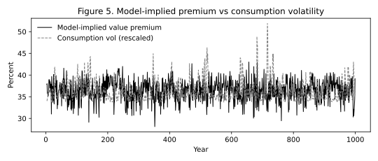

# 5. Asset Pricing Implications
{: .no_toc }

1. TOC
{:toc}

Cash-flow parameters are locked. I ask the Euler equation what returns and price–dividend ratios must be. I do not retune $$\phi$$ if the premium comes out wrong.

Table VII has two objects. The market row is the time-series property of the aggregate equity claim — the usual check that a consumption-based model can accommodate the equity premium, the risk-free rate, and market $$\log(P/D)$$. The value and growth rows are the cross-sectional property. Matching the market alone would not resolve the puzzle.

The model produces a value premium of about 5.3 percent against about 6 percent in the data, a lower price–dividend ratio on value than on growth, and CAPM betas that continue to fail. The same calibration accommodates the time-series behavior of the market.

Success is three cross-sectional facts together. Value’s expected return exceeds growth’s by about the right amount. Value’s price–dividend ratio is lower. Value’s CAPM beta is not larger than growth’s. The risk being priced is exposure to $$x_t$$, which is not covariance with the market portfolio.

[Section 4]() never saw mean returns. If Table VII’s model column is close to the data, the premium is coming from differential $$\phi$$ and the Epstein–Zin price of long-run news. [Section 6]() and [Section 7]() ask whether that cross-sectional pricing power survives when the characteristic is no longer book-to-market.

## 5.1 What would count as failure

- Value’s expected return below growth’s, or a negligible gap.
- Value’s price–dividend ratio *above* growth’s.
- Value’s CAPM beta much larger than growth’s, so that market covariance would have been enough.

The paper avoids all three.

## 5.2 Moments from the solved chain

The solver returns log price–dividend $$z$$ at each state $$(x,\sigma^2)$$. The Markov chain has a stationary distribution. I average the one-period returns implied by $$z$$ under that distribution, integrating the short-run shock with the same Gauss–Hermite rule as the Euler loop. That is Table VII’s model column (mean and standard deviation across 1000 simulated 74-year histories in the paper).

```python
from kiku_value_premium.model import get_table_ii_params, ModelSolver
from kiku_value_premium.implications import (
    compute_asset_pricing_moments, print_asset_pricing_moments,
    figure_lr_premium, figure_mean_pd, figure5,
)

params = get_table_ii_params()
solver = ModelSolver(params, n_x=30, n_s=4, n_quad=7)
solver.solve()
print_asset_pricing_moments(compute_asset_pricing_moments(solver))
```

`solve_analytical` is the Section 3.4 shortcut used for the long-run premium figure. On a tiny $$5\times 2$$ grid the Euler map floors numerical $$\log(P/D)$$; the published mean-P/D figure uses the linearization points 3.65 / 3.10 / 3.24.

## 5.3 Expected returns and valuations (Table VII)

{: .paper }
“I show that the model goes a long way towards resolving the value premium puzzle — it quantitatively replicates the observed magnitude of the value premium and, at the same time, accommodates the empirical failure of the CAPM and C-CAPM.” Model value premium about 5.3 percent versus about 6 percent in the data. Sharpe ratios 0.34 versus 0.20. Mean P/D about 24.7 (value) versus 39.8 (growth).

|  | E[R] % data | E[R] % model | E[pd] data | E[pd] model |
|:---|---:|---:|---:|---:|
| Growth | 7.81 (1.98) | 6.07 (2.91) | 3.61 (0.18) | 3.65 (0.06) |
| Value | 13.88 (1.74) | 11.36 (4.30) | 3.25 (0.12) | 3.10 (0.15) |
| Market | 8.56 (1.79) | 7.53 (2.69) | 3.34 (0.13) | 3.24 (0.07) |
| Risk-free | 0.91 (0.39) | 1.58 (0.01) |  |  |

Return volatilities: data 20.2 / 29.9 / 20.1; model 21.5 / 29.0 / 20.1. The package recovers the ranking: expected returns value above market above growth, and $$\log(P/D)$$ value below market below growth.

Value is both the high-return claim and the low price–dividend claim. That pair is what leverage on $$x_t$$ is supposed to deliver. The market row is the time-series check that the same investor still prices the aggregate claim.

## 5.4 CAPM and C-CAPM (Table VIII)

A larger $$\phi$$ is not the same object as a larger CAPM beta. In the data value’s market beta is not the source of the premium. The model must fail the CAPM for the same reason: the priced risk is exposure to $$x_t$$.

The model-implied ratio of value to growth CAPM betas is 0.92; for consumption betas, 0.85. Value’s market beta is *lower* than growth’s, as in the data. The package asserts $$\beta_V/\beta_G<1$$ on the solved grid.

## 5.5 Return correlations (Table IX)

Printed: GV 0.75 (0.05), GM 0.95 (0.01), VM 0.87 (0.04). Model: 0.44, 0.82, 0.60. The model undershoots the value–growth return correlation. Table X is return predictability on $$\log(P/D)$$ at one- and five-year horizons.

## 5.6 The long-run channel

Before trusting the 30×4 grid, I look at the linearization. Value’s larger $$\phi$$ raises $$A_1$$ in (11) and therefore compensation for $$\epsilon$$-news in (14). That is the mechanism, stripped of short-run noise.


<p class="caption">Analytical long-run premia. The gap is $$\phi_V=6.2$$ versus $$\phi_G=2.6$$, scaled by $$\rho=0.98$$ and the Epstein–Zin price of long-run news. This is not yet the 5.3 percent in Table VII; it is why that number is not a mystery.</p>


<p class="caption">Section 3.4 points: growth 3.65, market 3.24, value 3.10. Value is cheaper per unit of current dividend because more of its cash-flow risk is long-run risk.</p>

## 5.7 Does the model move the expected premium? (Figure 5)

Figure 2 in the data said the expected value premium rises with consumption uncertainty. Figure 5 runs the same construction on 1000 simulated annual observations. If the model’s $$\sigma_t^2$$ and $$\phi$$ gap are doing the work, the two series still comove.



<p class="caption">Figure 5. Model analogue of Figure 2. The expected value premium lines up with consumption uncertainty on simulated histories.</p>
