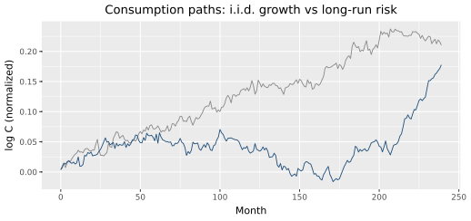
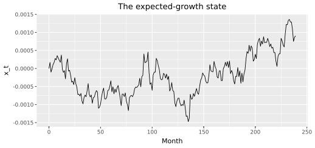
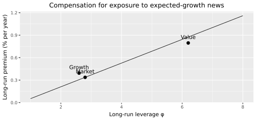

# The long-run risks model
{: .no_toc }

1. TOC
{:toc}

Here is the model. It has exactly two parts, and they are the two halves of every DCF you have ever built. A consumption process with a small persistent component tells us where cash-flow growth comes from. A household that fears news about that component tells us where the discount rate comes from. The chapter ends with the one expression where the halves meet — the elasticity of valuations to long-run news — and with compensation plotted against cash-flow leverage, drawn before we touch a single return.

Why go to this trouble? Because "the market went down, the discount rate must have risen" is not economics, it is poetry. A model earns the name only if its state variable is something you can measure and its predictions are things that can fail. The state variable here is expected consumption growth; the predictions are valuations *and* risk premia. [Measuring leverage]({{ '/measuring-leverage.html' | relative_url }}) estimates the loadings. [Does the market still fit?]({{ '/time-series.html' | relative_url }}) and [Value versus growth]({{ '/cross-section.html' | relative_url }}) run the tests. We do not extract $$x_t$$ from NIPA or match Table VII here.

We use the following packages. Run the chunks **in order** — later snippets reuse `paths` and `sol`.

```python
import numpy as np
import pandas as pd
import polars as pl
import plotnine as p9
import lrrcs as lrr
```

## The consumption process

Annual U.S. consumption growth is not white noise: its first autocorrelation is about 0.41. That matters more than it looks. The Mehra–Prescott equity-premium puzzle is stated under i.i.d. consumption growth and power utility — and under those assumptions the model premium is a rounding error. Bansal and Yaron (2004) change the endowment, not the arithmetic: split growth into a small persistent piece $$x_t$$ and a transitory shock,

$$
\Delta c_{t+1}=\mu+x_t+\sigma_t\eta_{t+1},\qquad
x_{t+1}=\rho x_t+\varphi_x\sigma_t e_{t+1}.
$$

In words: this period's growth is a trend, plus where expected growth currently stands, plus noise — and expected growth itself drifts slowly. A shock to $$x_t$$ is not news about this year; it is news about the next *decade* of consumption. That revision is long-run risk. Kiku (2006, Table II) uses monthly $$\rho=0.98$$, a half-life of about three years. The conditional volatility $$\sigma_t$$ moves too — news about future economic uncertainty — and it will matter, but $$x_t$$ carries this chapter.

Is such a component even visible? Barely — that is the point, and the standing objection to the whole enterprise. $$x_t$$ is a few tenths of a percent per month, easily buried under the transitory shocks. Look at what it does to the level of consumption anyway. Simulate two paths with the *same* short-run shocks: one i.i.d., one with $$x_t$$.

```python
mu, sigma, rho, phi_x = 0.0015, 0.0064, 0.98, 0.032
T = 240
rng = np.random.default_rng(1)
eta = rng.standard_normal(T)
eps = rng.standard_normal(T)

iid = mu + sigma * eta
x = np.zeros(T)
dc_m = np.empty(T)
for t in range(T):
    dc_m[t] = mu + x[t] + sigma * eta[t]
    if t + 1 < T:
        x[t + 1] = rho * x[t] + phi_x * sigma * eps[t]

paths = pd.DataFrame({
    "t": np.arange(T),
    "iid": np.cumsum(iid),
    "lrr": np.cumsum(dc_m),
    "x": x,
})
(
    p9.ggplot(paths, p9.aes("t"))
    + p9.geom_line(p9.aes(y="iid"), color="#888888")
    + p9.geom_line(p9.aes(y="lrr"), color="#1f4e79")
    + p9.labs(
        x="Month",
        y="log C (normalized)",
        title="Consumption paths: i.i.d. growth vs long-run risk",
    )
)
```



<p class="caption">Gray: i.i.d. growth. Blue: the same short-run shocks plus a small but highly persistent component in consumption growth. That extra low-frequency swing is long-run risk.</p>

```python
(
    p9.ggplot(paths, p9.aes("t", "x"))
    + p9.geom_line()
    + p9.labs(x="Month", y="x_t", title="The expected-growth state")
)
```



<p class="caption">$$x_t$$ is small (a few tenths of a percent per month) and highly persistent. That is the low-frequency risk embodied in cash flows.</p>

For the DCF reader: mean growth is $$\mu$$. $$x_t$$ is the *deviation* of expected growth from that mean — not a constant $$g$$ plugged into a terminal value, but a state of the economy that wanders, and that dividends inherit. In the CAPM the factor is $$R_m-r_f$$; here the factor is news about $$x_t$$ — and, separately, news about future uncertainty. Extracting $$x_t$$ from seventy-four years of annual data is the appendix of [Does the market still fit?]({{ '/time-series.html' | relative_url }}).

## The household

Now the discount rate. Under power utility one parameter does two jobs: risk aversion $$\gamma$$ and the elasticity of intertemporal substitution are forced to be reciprocals, $$\gamma = 1/\psi$$. An investor who dislikes consumption *risk* is thereby forced to dislike consumption *growth*, which is absurd — and quantitatively fatal, because persistent good news about growth would crush valuations through the interest-rate channel. Epstein and Zin (1989) and Weil (1989) cut the knot. The intertemporal marginal rate of substitution is

$$
M_{t+1}=\delta^\theta (C_{t+1}/C_t)^{-\theta/\psi} R_{c,t+1}^{\theta-1},
\qquad
\theta=\frac{1-\gamma}{1-1/\psi}.
$$

Read it in English: marginal utility falls with consumption growth, as always — but it also moves with $$R_{c,t+1}$$, the return on the aggregate wealth portfolio, which is the market's forward-looking assessment of *all future consumption*. Table II sets $$\delta=0.999$$, $$\gamma=10$$, $$\psi=1.5$$.

The economic reason $$\psi>1$$ is the interest-rate channel. Persistent good news about growth raises the risk-free rate. If the EIS is small, that rate effect crushes valuations and cash-flow leverage cannot produce a value premium. Epstein–Zin is here so the cash-flow term in $$A_1$$ can win.

```python
delta, gamma, psi = 0.999, 10.0, 1.5
theta = (1.0 - gamma) / (1.0 - 1.0 / psi)
gamma, 1.0 / psi, theta
```

```text
(10.0, 0.667, -27.0)
```

$$\theta = -27$$, not 1. That is the whole trick. With $$\gamma > 1/\psi$$, the household is more averse to risk than to substitution over time, prefers early resolution of uncertainty, and — through the $$R_{c,t+1}^{\theta-1}$$ term — dreads assets that fall *when there is bad news about long-run consumption growth*, not merely when this year's consumption dips. Under power utility $$\theta=1$$, the wealth-return term vanishes, and no amount of persistence in $$x_t$$ produces a sizable premium: only next period's consumption enters marginal utility, and next period's consumption barely moves.

The pricing theory is still one line — the Euler equation, $$\mathrm{E}_t[M_{t+1}R_{i,t+1}]=1$$ — and its outputs are valuations and risk premia together.

## Compensation versus cash-flow leverage

The cash-flow model for an individual claim is one equation:

$$
\Delta d_{t+1}=\mu_d+\phi x_t+\varphi_\sigma\sigma_t u_{t+1}.
$$

Dividend growth inherits expected consumption growth with leverage $$\phi$$, plus its own noise. $$\phi$$ is where firms differ: it measures how much low-frequency consumption risk is embodied in a firm's cash flows. It is the model's characteristic — its answer to CAPM beta — and it is a property of *dividends*, estimable without ever looking at a return.

Log-linearize, and the price–dividend ratio is affine in the state, $$z_t=\bar z+A_1 x_t+\cdots$$, with

$$
A_1=\frac{\phi-1/\psi}{1-\kappa_1\rho}.
$$

Stop and look at this expression, because it is where the two halves of the model — and the two halves of your DCF — meet in a single fraction. $$\phi$$ is the cash-flow model: how hard dividends lever long-run news. $$1/\psi$$ is the household: how hard the interest rate pushes back when expected growth rises. $$\rho$$ is the endowment's persistence, amplified by the discounting constant $$\kappa_1\approx 0.96$$. Good news about $$x_t$$ raises expected cash flows (the $$\phi$$ term, your $$g$$) and raises discount rates a little (the $$1/\psi$$ term, your $$r$$); with $$\phi > 1/\psi$$ and $$\rho$$ near one, the cash-flow effect wins by a wide margin and valuations react strongly. In a DCF, $$r$$ and $$g$$ never talk to each other. Here they are two terms of the same numerator.

The long-run risk premium is $$A_1$$ times the price of long-run news. So the model draws expected compensation against $$\phi$$ — cash-flow leverage on the horizontal axis where the CAPM puts return beta. Draw it, then place Table II's three claims on it.

```python
psi, rho, gamma = 1.5, 0.98, 10.0
phi_x, sigma = 0.032, 0.0064
mean_zc = 3.5
kappa_c1 = np.exp(mean_zc) / (1.0 + np.exp(mean_zc))
ratio = kappa_c1 * phi_x / (1.0 - kappa_c1 * rho)
Lambda_eps = (gamma - 1.0 / psi) * ratio
mean_z = 3.24
kappa1 = np.exp(mean_z) / (1.0 + np.exp(mean_z))
phis = np.linspace(1.0, 8.0, 29)
A1 = (phis - 1.0 / psi) / (1.0 - kappa1 * rho)
prem = 12.0 * kappa1 * A1 * phi_x * Lambda_eps * (sigma ** 2) * 100
line = pd.DataFrame({"phi": phis, "premium": prem})

sol = lrr.solve_analytical(lrr.get_table_ii_params())
pts = pd.DataFrame({
    "phi": [2.6, 2.8, 6.2],
    "premium": [100 * sol.premium_lr[k] for k in ("growth", "market", "value")],
    "name": ["Growth", "Market", "Value"],
})
(
    p9.ggplot()
    + p9.geom_line(line, p9.aes("phi", "premium"))
    + p9.geom_point(pts, p9.aes("phi", "premium"), size=3)
    + p9.geom_text(pts, p9.aes("phi", "premium", label="name"), nudge_y=0.08)
    + p9.labs(
        x="Long-run leverage φ",
        y="Long-run premium (% per year)",
        title="Valuations’ compensation for low-frequency cash-flow risk",
    )
)
```



<p class="caption">Expected compensation against exposure of dividends to long-run consumption shocks, not CAPM $$\beta$$. Value firms are highly exposed to those shocks; growth firms less so. That dispersion shows up in valuations and in ex-ante premia.</p>

```text
A1 growth 43.1, market 37.5, value 88.9
Lambda_eps  5.95
```

Value's $$A_1$$ is about twice growth's. The same cash-flow leverage that earns value a high premium makes its valuation more fragile: its price–dividend ratio is more elastic to long-run consumption news, so it must offer high ex-ante compensation. Notice what this is *not*: a prediction that value has a larger CAPM beta. Often it does not — market betas mostly reflect transitory price fluctuations, not the permanent cash-flow risk that carries the big price here.

`lrr.solve_analytical` is this linearization for every claim in `ModelParams`. The points on the figure come from Table II: $$\phi_G=2.6$$, $$\phi_m=2.8$$, $$\phi_V=6.2$$.

One rule, and it is the book's discipline: do **not** estimate $$\phi$$ from returns. $$\phi$$ is a cash-flow exposure, measured from dividends and consumption. Average returns, Sharpe ratios, and CAPM betas stay out of that step, so that the Euler equation remains a *test*: given those cash-flow numbers, do valuations and risk premia look like the data? [Measuring leverage]({{ '/measuring-leverage.html' | relative_url }}) is that measurement. [Does the market still fit?]({{ '/time-series.html' | relative_url }}) runs the test on the market. [Value versus growth]({{ '/cross-section.html' | relative_url }}) runs it on value and growth.

## Key takeaways

- The consumption process is where growth comes from: a small, highly persistent component $$x_t$$ plus transitory noise plus time-varying uncertainty. Mean growth is $$\mu$$; $$x_t$$ is the deviation of expected growth from that mean.
- The Epstein–Zin household is where the discount rate comes from: with $$\gamma > 1/\psi$$ and $$\psi>1$$, the interest-rate channel does not crush valuations when expected growth rises, and marginal utility responds to the return on total wealth.
- The halves meet in $$A_1=(\phi-1/\psi)/(1-\kappa_1\rho)$$: cash-flow leverage and the household's substitution motive in one fraction. Because $$\rho$$ is near one, small persistent news moves valuations a lot.
- Firms differ only in the exposure of their dividends to low- versus high-frequency consumption shocks. That dispersion — not return covariances — is what the equilibrium turns into valuations and premia.
- $$\phi$$ is estimated from cash flows. Returns are the test.

Next: [Measuring leverage]({{ '/measuring-leverage.html' | relative_url }}).

## Exercises

1. Set $$\psi=1/\gamma=0.1$$ so that $$\theta=1$$. Recompute the premium-versus-$$\phi$$ line. What happens to the slope?
2. Lower $$\rho$$ from 0.98 to 0.90 and recompute $$A_1$$ for $$\phi=6.2$$. How much of the value claim's elasticity came from persistence?
3. Set $$\varphi_x=0$$ (no long-run risk in consumption) and recompute the premium-versus-$$\phi$$ line. Where did the slope go?
