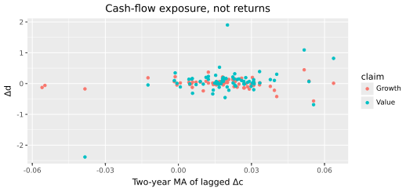
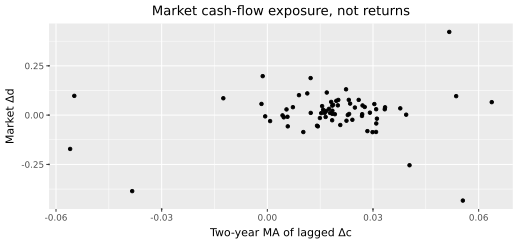

# Measuring leverage
{: .no_toc }

1. TOC
{:toc}

The characteristic in this model is not a return beta. It is how hard a claim's *dividends* load on the persistent piece of consumption growth. Kiku's equation (19) is that loading. The right-hand side is a two-year moving average of lagged consumption growth. There is no return on the page.

[The result]({{ '/getting-started.html' | relative_url }}) took Table II's monthly \(\phi\) on faith. This chapter estimates the annual ranking those numbers have to respect. Preferences stay out of it.

We use the following packages. Run the chunks **in order**.

```python
import numpy as np
import pandas as pd
import polars as pl
import plotnine as p9
import lrrcs as lrr

dc = pl.read_csv("data/consumption_annual.csv").sort("year")
panel = pl.read_csv("data/annual_panel.csv")
y = dc["dc"].to_numpy()
```

The series themselves were built in [Financial data]({{ '/financial-data.html' | relative_url }}). You do not rebuild them here.

## The two-year MA

Raw annual \(\Delta c\) is jagged. Average the last two years (not the current year) and the slow component is visible.

```python
window = 2
ma = np.full(len(y), np.nan)
for t in range(window, len(y)):
    ma[t] = float(np.mean(y[t - window : t]))
dc.with_columns(pl.Series("ma", ma)).head(6)
lrr.expected_growth_proxy(y, window=2)[:6]
```

```text
 year     dc      ma
 1930  -0.053     NA
 1931  -0.024     NA
 1932  -0.088  -0.038
 1933  -0.021  -0.056
 1934   0.062  -0.055
 1935   0.042   0.020
```

```python
plot_df = dc.with_columns(pl.Series("ma", ma))
(
    p9.ggplot(plot_df.to_pandas(), p9.aes("year"))
    + p9.geom_line(p9.aes(y="dc"))
    + p9.geom_line(p9.aes(y="ma"), color="steelblue")
    + p9.labs(
        x="Year",
        y="Δc",
        title="Consumption growth and a two-year MA of lags",
    )
)
```


<p class="caption">Raw annual \(\Delta c\) (black) and the two-year MA of lagged growth (blue). The blue line is the annual picture of \(x_t\).</p>

Calibration uses the MA, as in the paper. Do **not** take \(\phi\) from a filter of \(x_t\).

## Equation (19)

\[
\Delta d_t = d_0 + \tilde\phi \,\mathrm{MA}(\Delta c, 2) + \varepsilon_t.
\tag{19}
\]

Align each claim's `dgrowth` with the same `ma`. OLS with an intercept. No price, no premium, no CAPM residual.

```python
def phi_hat(claim):
    dd = (
        panel.filter(pl.col("claim") == claim)
        .join(dc, on="year")
        .sort("year")["dgrowth"]
        .to_numpy()
    )
    mask = np.isfinite(ma) & np.isfinite(dd)
    x = ma[mask] - ma[mask].mean()
    e = dd[mask] - dd[mask].mean()
    return float(np.dot(x, e) / np.dot(x, x))

{c: round(phi_hat(c), 3) for c in ("Growth", "Value", "Market")}
```

```text
{'Growth': -0.267, 'Value': 12.129, 'Market': 0.722}
```

There is the risk, in the cash flows where the model said it would be. Value's dividend growth rises hard with the slow component of consumption; growth's barely responds, on this reconstruction it even leans the other way.

The annual slopes are **not** the numbers the solver uses. They are the ranking Table II's monthly loadings have to respect. Monthly \(\phi\) is a different clock.

Seventy-two annual observations buy you a ranking, not a third decimal. The ranking matches Kiku's Table VI in one respect: value loads more than growth. It does not match the growth point estimate. She prints \(-0.38\) / \(2.16\) / \(0.66\). We print \(-0.27\) / \(12.13\) / \(0.72\). Value \(\gg\) growth survives. The sign on growth does not.

```python
plot_df = (
    panel.filter(pl.col("claim").is_in(["Growth", "Value"]))
    .join(dc.with_columns(pl.Series("ma", ma)).select("year", "ma"), on="year")
    .filter(pl.col("ma").is_finite() & pl.col("dgrowth").is_finite())
)
(
    p9.ggplot(plot_df.to_pandas(), p9.aes("ma", "dgrowth", color="claim"))
    + p9.geom_point()
    + p9.labs(
        x="Two-year MA of lagged Δc",
        y="Δd",
        title="Cash-flow exposure, not returns",
    )
)
```



<p class="caption">Value and growth dividend growth against the two-year MA of lagged consumption. Value's slope is steeper. Average returns never entered.</p>

```python
plot_m = (
    panel.filter(pl.col("claim") == "Market")
    .join(dc.with_columns(pl.Series("ma", ma)).select("year", "ma"), on="year")
    .filter(pl.col("ma").is_finite() & pl.col("dgrowth").is_finite())
)
(
    p9.ggplot(plot_m.to_pandas(), p9.aes("ma", "dgrowth"))
    + p9.geom_point()
    + p9.labs(
        x="Two-year MA of lagged Δc",
        y="Market Δd",
        title="Market cash-flow exposure, not returns",
    )
)
```



<p class="caption">Market dividend growth against the same MA. The annual slope is \(\tilde\phi \approx 0.72\).</p>

`lrr.estimate_long_run_leverage` and `lrr.calibrate_from_data` wrap the same arithmetic. There is no argument for returns. The function will not take one.

```python
def dd(claim):
    return (
        panel.filter(pl.col("claim") == claim)
        .join(dc, on="year")
        .sort("year")["dgrowth"]
        .to_numpy()
    )

div = lrr.calibrate_from_data(
    y,
    frequency="annual",
    window=2,
    long=dd("Value"),
    short=dd("Growth"),
    market=dd("Market"),
)
lrr.print_calibration_summary(div)
```

```text
Portfolio          μ (m)     φ (long-run)   φ_σ      α
-------------------------------------------------------
market              0.00076     0.722       5.33    0.57
```

The solver wants *monthly* \(\phi\). Table II locks \(\phi_G=2.6\), \(\phi_m=2.8\), \(\phi_V=6.2\). Those are the numbers [The result]({{ '/getting-started.html' | relative_url }}) already priced. The annual slopes are why those monthly loadings are allowed to differ, not substitutes for them.

## Key takeaways

- \(\phi\) is a property of dividends and consumption. Average returns stay out of the step, so the Euler equation remains a test.
- The check is the ranking: value loads hard on the slow component, growth barely, the market in between. The growth point estimate is not Table VI's.
- Table II's monthly loadings are what the solver uses. The annual OLS is why those loadings are allowed to differ.

Next: [Does the market still fit?]({{ '/time-series.html' | relative_url }}), where the same household prices the market.

## Exercises

1. Replace the two-year MA with `lrr.expected_growth_proxy(y, window=3)` and recompute the three slopes. Does the ranking survive?
2. Drop 1930 to 1945 from the OLS. Does value still have the larger \(\tilde\phi\)?
3. Call `lrr.calibrate_from_data` with only `market=dd("Market")`. Confirm there is still no place to pass a return.
