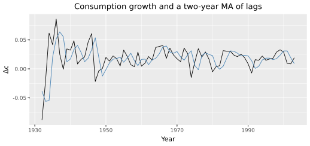
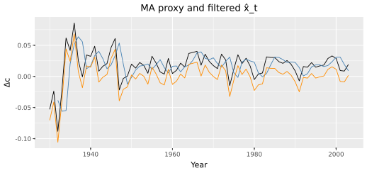
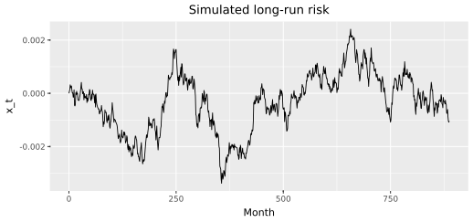
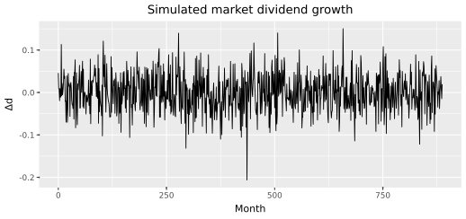
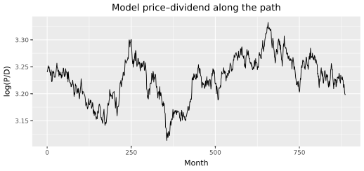

# The market
{: .no_toc }

1. TOC
{:toc}

In this chapter we take the consumption and market-dividend series from [Financial data]({{ '/financial-data.html' | relative_url }}) and ask whether the general equilibrium can match the **valuations and risk premia** of the aggregate claim — the value-weighted market — year after year. That is the time-series test Bansal and Yaron (2004) wrote the model for. One claim. Not a ranking of firms.

Long-run risks are a small but highly persistent component that governs consumption growth ($$x_t$$), plus time-variation in the conditional volatility of consumption — news about future economic uncertainty. The market’s dividends are one claim’s exposure to those low-frequency shocks. Time-non-separable Epstein–Zin preferences break the link between smoothing consumption over time and across states, so the MRS depends on the forward-looking return on the aggregate wealth portfolio. Coupled with those preferences, the market’s exposure entails a significant risk premium and large reactions in the price–dividend ratio: shocks to the growth-rate component alter expectations far into the future, leading to sizable risk compensations. Valuations and risk premia depend on the amount of low-frequency risks embodied in cash flows.

We (i) show that consumption growth is persistent, (ii) extract $$x_t$$ two ways, (iii) measure the market’s cash-flow exposure to long-run consumption news, (iv) simulate the cash-flow process, and (v) check whether the Euler equation matches **both** the equity premium and the valuation (mean $$\log P/D$$). Average returns never enter (iii). The objects are those of [the long-run risks model]({{ '/long-run-risks-model.html' | relative_url }}).

We use the following packages. Run the chunks **in order**, as on [Tidy Finance’s beta-estimation chapter](https://www.tidy-finance.org/chapters/beta-estimation.html): later snippets reuse `dc`, `mkt`, and `y`.

```python
import numpy as np
import pandas as pd
import polars as pl
import plotnine as p9
import lrrcs as lrr

start, end = 1930, 2003
```

## Preparing the sample

[Financial data]({{ '/financial-data.html' | relative_url }}) wrote annual consumption growth and Campbell–Shiller market dividends for 1930–2003. We join them on `year`. `ret` is the real simple return, `dgrowth` is log dividend growth, `pd` is the year-end price–dividend ratio.

```python
dc = pl.read_csv("data/consumption_annual.csv").sort("year")
panel = pl.read_csv("data/annual_panel.csv")
rf = pl.read_csv("data/rf_annual.csv")
mkt = (
    panel.filter(pl.col("claim") == "Market")
    .join(dc, on="year")
    .sort("year")
)
mkt.head()
```

```text
 year  claim   ret      dgrowth    pd      dc
 1930  Market -0.258    -0.026     15.76  -0.053
 1931  Market -0.377    -0.131     10.52  -0.024
 1932  Market  0.044    -0.385     15.07  -0.088
 1933  Market  0.632    -0.172     28.00  -0.021
 1934  Market -0.013     0.098     24.06   0.062
 1935  Market  0.419     0.077     30.34   0.042
```

Seventy-four annual observations. Consumption growth averages 1.75 percent with volatility 2.36 percent. The first autocorrelation is 0.41 — not white noise. Market returns average 8.5 percent; mean $$P/D$$ is about 31 (log $$P/D$$ about 3.33).

```python
y = dc["dc"].to_numpy()
print(len(y), y.mean() * 100, y.std(ddof=1) * 100)
print(np.corrcoef(y[:-1], y[1:])[0, 1])
mkt.select("ret", "dgrowth", "pd").describe()
```

```text
74 1.75 2.37
0.41
```

| statistic | ret | dgrowth | pd |
|:---|---:|---:|---:|
| mean | 0.085 | 0.009 | 30.85 |
| std | 0.201 | 0.110 | 16.07 |
| min | −0.377 | −0.433 | 10.52 |
| max | 0.632 | 0.422 | 88.07 |

## What long-run risk is

If consumption growth were i.i.d., only the current shock $$\eta_{t+1}$$ would be priced. Bansal and Yaron (2004) split growth into a small persistent piece $$x_t$$ and a transitory shock:

$$
\Delta c_{t+1}=\mu+x_t+\sigma_t\eta_{t+1},\qquad
x_{t+1}=\rho x_t+\varphi_x\sigma_t e_{t+1}.
$$

$$x_t$$ is the small but highly persistent component that governs consumption growth; $$\sigma_t$$ allows time-variation in the conditional volatility of consumption — news about future economic uncertainty. A shock to the growth-rate component significantly alters investors’ expectations about consumption far into the future, leading to large reactions in stock prices and sizable risk compensations. Time-non-separable Epstein–Zin preferences break the link between smoothing over time and across states, so the MRS depends on the forward-looking return on the aggregate wealth portfolio and that news is priced. A claim’s loading $$\phi$$ is the amount of low-frequency risks embodied in its cash flows.

You can already *see* $$x_t$$ in the annual data. Average the last two years of consumption growth. Raw $$\Delta c$$ is jagged. The moving average is the slow component.

```python
plot_df = dc.with_columns(
    pl.col("dc").shift(1).rolling_mean(window_size=2).alias("ma")
)
(
    p9.ggplot(plot_df.to_pandas(), p9.aes("year"))
    + p9.geom_line(p9.aes(y="dc"))
    + p9.geom_line(p9.aes(y="ma"), color="steelblue")
    + p9.labs(
        x="Year",
        y="Δc",
        title="Consumption growth and a two-year MA of lags",
    )
)
```



<p class="caption">Raw annual $$\Delta c$$ (black) and the two-year MA of lagged growth (blue). The blue line is the annual picture of $$x_t$$.</p>

Table II of Kiku (2006) puts this object on a monthly clock with $$\rho=0.98$$ (about $$0.98^{12}\approx 0.78$$ per year in a simple compounding sense; the annual MA is the counterpart we can plot).

## Estimate x_t

### A moving-average proxy

Kiku’s equation (19) uses exactly that two-year MA as the regressor for dividend growth. Write it without the package: at date $$t$$, average $$\Delta c_{t-2}$$ and $$\Delta c_{t-1}$$ (not the current year).

```python
window = 2
ma = np.full(len(y), np.nan)
for t in range(window, len(y)):
    ma[t] = float(np.mean(y[t - window : t]))
dc.with_columns(pl.Series("ma", ma)).head(6)
```

```text
 year     dc      ma
 1930  -0.053     NA
 1931  -0.024     NA
 1932  -0.088  -0.038
 1933  -0.021  -0.056
 1934   0.062  -0.055
 1935   0.042   0.020
```

The first two years are missing by construction. The same array is `lrr.expected_growth_proxy(y, window=2)`.

### A Kalman filter

The solver does not iterate a two-year MA. It iterates an AR(1) state. The annual analogue is the linear Gaussian system

$$
y_t=\mu+x_t+v_t,\qquad x_{t+1}=\rho x_t+w_t,
$$

with $$v_t\sim N(0,r)$$ and $$w_t\sim N(0,q)$$. The Kalman filter gives $$E[x_t\mid y_{1:t}]$$. We estimate $$(\rho,q,r)$$ by maximum likelihood. This is the whole procedure, not a call to a black box:

```python
from scipy.optimize import minimize

def kalman_filter(y, mu, rho, q, r):
    n = y.size
    x_filt = np.empty(n)
    x_pred = 0.0
    p_pred = q / max(1.0 - rho * rho, 1e-8)
    loglik = 0.0
    for t in range(n):
        innov = y[t] - mu - x_pred
        s = p_pred + r
        k = p_pred / s
        x_upd = x_pred + k * innov
        p_upd = (1.0 - k) * p_pred
        loglik += -0.5 * (np.log(2.0 * np.pi * s) + innov * innov / s)
        x_filt[t] = x_upd
        x_pred = rho * x_upd
        p_pred = rho * rho * p_upd + q
    return loglik, x_filt

mu = float(y.mean())
var = float(np.var(y))
rho0 = float(np.clip(np.corrcoef(y[:-1], y[1:])[0, 1], 1e-6, 0.999))
q0 = r0 = max(var / 2.0, 1e-12)

def nll(theta):
    rho, q, r = theta
    ll, _ = kalman_filter(y, mu, rho, q, r)
    return -ll if np.isfinite(ll) else 1e20

res = minimize(
    nll,
    x0=np.array([rho0, q0, r0]),
    method="L-BFGS-B",
    bounds=[(1e-6, 0.999), (1e-12, None), (1e-12, None)],
)
rho, q, r = res.x
loglik, x_filt = kalman_filter(y, mu, rho, q, r)
rho, q, r, loglik
```

```text
(0.43, 0.00046, 1e-12, 178.9)
```

Annual persistence comes back at about 0.43, close to the raw AC1 of 0.41. Measurement-error variance sits on the lower bound: once $$x_t$$ is in the model, almost all of the annual series is state, not noise. `lrr.filter_expected_growth(y)` is this filter plus the MLE. Overlay the two extractors:

```python
plot_df = dc.with_columns(
    pl.Series("ma", ma),
    pl.Series("x_filt", x_filt),
)
(
    p9.ggplot(plot_df.to_pandas(), p9.aes("year"))
    + p9.geom_line(p9.aes(y="dc"))
    + p9.geom_line(p9.aes(y="ma"), color="steelblue")
    + p9.geom_line(p9.aes(y="x_filt"), color="darkorange")
    + p9.labs(x="Year", y="Δc", title="MA proxy and filtered x̂_t")
)
```



<p class="caption">Consumption growth, the MA proxy (blue), and the Kalman filter $$\hat x_t$$ (orange). Filtered annual $$\rho\approx 0.43$$. The solver iterates the monthly counterpart $$0.98$$.</p>

Do **not** take $$\phi$$ or Table II numbers from this filter. Calibration uses the MA, as in the paper.

## Calibrate dividends

Kiku (2006) equation (19) is a regression of dividend growth on the two-year MA of lagged consumption:

$$
\Delta d_t=d_0+\tilde\phi\,\mathrm{MA}(\Delta c,2)+\varepsilon_t.
$$

No return on the right-hand side. Align the market `dgrowth` series with `ma` and run OLS with an intercept.

```python
dd = mkt["dgrowth"].to_numpy()
mask = np.isfinite(ma) & np.isfinite(dd)
x = ma[mask] - ma[mask].mean()
e = dd[mask] - dd[mask].mean()
phi_tilde = float(np.dot(x, e) / np.dot(x, x))
resid = dd[mask] - (dd[mask].mean() + phi_tilde * (ma[mask] - ma[mask].mean()))
# short-run correlation with the consumption innovation
innov = np.empty_like(y)
innov[0] = 0.0
rho_c = float(np.corrcoef(y[:-1], y[1:])[0, 1])
innov[1:] = y[1:] - rho_c * y[:-1]
alpha = float(np.corrcoef(resid, innov[mask])[0, 1])
phi_sigma = float(np.std(resid) / np.std(innov[mask]))
mu_d_annual = float(np.mean(dd))
phi_tilde, mu_d_annual, phi_sigma, alpha
```

```text
(0.722, 0.0092, 5.33, 0.57)
```

The slope $$\tilde\phi=0.72$$ is the *ranking check* (Kiku’s Table VI prints about 0.66 for the market, with a large standard error). `lrr.estimate_long_run_leverage` and `lrr.calibrate_from_data` wrap the same arithmetic.

```python
lrr.estimate_long_run_leverage(y, dd, window=2)
lrr.print_calibration_summary(
    lrr.calibrate_from_data(y, market=dd, frequency="annual", window=2)
)
```

```text
Portfolio          μ (m)     φ (long-run)   φ_σ      α
-------------------------------------------------------
market              0.00076     0.722       5.33    0.57
```

The solver wants *monthly* $$\phi$$. Table II locks $$\mu=0.0012$$, $$\phi=2.8$$, $$\varphi_\sigma=7.5$$, $$\alpha=0.55$$. Simulation and pricing below use those numbers, not the annual slope as a monthly loading. Average returns never entered.

## Simulate cash flows

The monthly recursion is the same split we plotted, now at Table II values. Write one path, annualize by summing twelve log-growths, then repeat.

```python
mu_c, rho, phi_x, sigma = 0.0015, 0.98, 0.032, 0.0064
nu, sigma_w = 0.99, 0.0000017
mu_d, phi, phi_sig, alpha = 0.0012, 2.8, 7.5, 0.55
years, n_sims, seed = 74, 20, 1

def annualize(monthly):
    n = len(monthly) // 12
    return monthly[: n * 12].reshape(n, 12).sum(axis=1)

def one_path(rng, T):
    x = np.zeros(T)
    s2 = np.full(T, sigma ** 2)
    dc_m = np.empty(T)
    dd_m = np.empty(T)
    for t in range(T):
        eta = rng.standard_normal()
        dc_m[t] = mu_c + x[t] + np.sqrt(s2[t]) * eta
        u = alpha * eta + np.sqrt(max(1.0 - alpha ** 2, 0.0)) * rng.standard_normal()
        dd_m[t] = mu_d + phi * x[t] + phi_sig * np.sqrt(s2[t]) * u
        if t + 1 < T:
            eps = rng.standard_normal()
            w = rng.standard_normal()
            x[t + 1] = rho * x[t] + phi_x * np.sqrt(s2[t]) * eps
            s2[t + 1] = max(sigma ** 2 * (1 - nu) + nu * s2[t] + sigma_w * w, 1e-12)
    return x, s2, dc_m, dd_m

rng = np.random.default_rng(seed)
T = years * 12
cons_mean, cons_vol, cons_ac1 = [], [], []
dd_mean, dd_vol = [], []
for _ in range(n_sims):
    _, _, dc_m, dd_m = one_path(rng, T)
    dc_a = annualize(dc_m)
    dd_a = annualize(dd_m)
    cons_mean.append(dc_a.mean() * 100)
    cons_vol.append(dc_a.std() * 100)
    cons_ac1.append(np.corrcoef(dc_a[:-1], dc_a[1:])[0, 1])
    dd_mean.append(dd_a.mean() * 100)
    dd_vol.append(dd_a.std() * 100)

{
    "E[dc]": np.mean(cons_mean),
    "sigma(dc)": np.mean(cons_vol),
    "AC1": np.mean(cons_ac1),
    "E[dd]": np.mean(dd_mean),
    "sigma(dd)": np.mean(dd_vol),
}
```

```text
{'E[dc]': 1.82, 'sigma(dc)': 2.44, 'AC1': 0.16, 'E[dd]': 0.68, 'sigma(dd)': 16.36}
```

Twenty samples of 74 years are noisy (annual AC1 in particular). With 1000 samples the model is close to the data on consumption: mean 1.86 vs 1.96, volatility 2.16 vs 2.20, AC1 0.43 vs 0.44. `lrr.simulate_cashflow_moments(n_sims=20, years=74, seed=1)` is the same Monte Carlo. If those cash-flow moments fail, stop. The premium next would be a free parameter in disguise.

## Solve and check returns and prices

The Euler equation is $$E_t[M_{t+1}R_{i,t+1}]=1$$ with the Epstein–Zin IMRS from [the long-run risks model]({{ '/long-run-risks-model.html' | relative_url }}). We do not re-derive it. The log-linear price–dividend ratio of a claim is affine in the state,

$$
z_t=\bar z+A_1 x_t+A_2(\sigma_t^2-\bar\sigma^2),
$$

with elasticity

$$
A_1=\frac{\phi-1/\psi}{1-\kappa_1\rho}.
$$

Larger $$\phi$$ means prices rise more when expected growth is high — and the long-run premium is $$A_1$$ times the price of $$x$$-news. With Table II’s market $$\phi=2.8$$, $$\psi=1.5$$, $$\rho=0.98$$, and $$\bar z=3.24$$:

```python
phi, psi, rho = 2.8, 1.5, 0.98
mean_z = 3.24
kappa1 = np.exp(mean_z) / (1.0 + np.exp(mean_z))
A1 = (phi - 1.0 / psi) / (1.0 - kappa1 * rho)
kappa1, A1
```

```text
(0.962, 56.3)
```

`lrr.solve_analytical` returns that elasticity for every claim, plus the long-run premium. Market $$A_1$$ is large: prices move a lot with $$x_t$$.

```python
params = lrr.get_table_ii_params()
sol = lrr.solve_analytical(params)
lrr.print_long_short_premium(sol)
```

```text
Approximate annualized long-run risk premia:
  growth  :   0.39%
  value   :   0.80%
  market  :   0.34%
Value-growth spread from long-run risks: 0.40%
A1 (PD elasticity to x): growth=43.1, value=88.9
Price of long-run risk Lambda_eps = 5.95
```

The test is whether the same locked cash-flow numbers reproduce **risk premia and valuations**. `lrr.compute_asset_pricing_moments` integrates the Euler equation on a grid. Kiku’s Table VII (1000 samples) is the comparison we want. A match on the equity premium with the wrong price–dividend ratio is a fail: the equilibrium objects come as a pair.

|  | E[R] % data | E[R] % model | E[pd] data | E[pd] model |
|:---|---:|---:|---:|---:|
| Market | 8.56 (1.79) | 7.53 (2.69) | 3.34 (0.13) | 3.24 (0.07) |
| Risk-free | 0.91 (0.39) | 1.58 (0.01) |  |  |

Market return volatility is 20.1 percent in both. The safe rate is about seventy basis points too high. The equity premium is a little short of the sample. Close enough to ask a second question.

One simulated monthly path, using the affine map we just wrote. $$A_2$$ is the elasticity of $$\log P/D$$ to news about future economic uncertainty — time-variation in the conditional volatility of consumption — from the same analytical solution.

```python
x, s2, dc_m, dd_m = one_path(np.random.default_rng(1), 74 * 12)
s2_bar = sigma ** 2
z = sol.mean_log_pd["market"] + sol.A1["market"] * x + sol.A2["market"] * (s2 - s2_bar)
sim = pd.DataFrame({"t": np.arange(len(x)), "x": x, "dd": dd_m, "log_pd": z})
(
    p9.ggplot(sim, p9.aes("t", "x"))
    + p9.geom_line()
    + p9.labs(x="Month", y="x_t", title="Simulated long-run risk")
)
(
    p9.ggplot(sim, p9.aes("t", "dd"))
    + p9.geom_line()
    + p9.labs(x="Month", y="Δd", title="Simulated market dividend growth")
)
(
    p9.ggplot(sim, p9.aes("t", "log_pd"))
    + p9.geom_line()
    + p9.labs(x="Month", y="log(P/D)", title="Model price–dividend along the path")
)
```



<p class="caption">One simulated monthly path of $$x_t$$.</p>



<p class="caption">Market dividend growth along the same path. High $$x_t$$ raises $$\Delta d$$ by $$\phi=2.8$$.</p>



<p class="caption">Model $$\log(P/D)$$ from $$z=\bar z+A_1 x+A_2(\sigma^2-\bar\sigma^2)$$. Valuations and risk premia have to match together.</p>

## Key takeaways

- Long-run risks are a small but highly persistent component that governs consumption growth, plus time-variation in the conditional volatility of consumption. A two-year MA, or a Kalman AR(1), is the annual picture of that component.
- Time-non-separable Epstein–Zin preferences make the MRS depend on the forward-looking return on the aggregate wealth portfolio, so a shock to $$x_t$$ that revises consumption far into the future produces large reactions in the price–dividend ratio and sizable risk compensations.
- The market’s cash flows are exposed to those low-frequency shocks ($$\tilde\phi\approx 0.72$$). Returns are not in the regression. Valuations and risk premia depend on the amount of low-frequency risks embodied in cash flows.
- $$A_2$$ is compensation for news about future economic uncertainty, alongside $$A_1$$ for the growth-rate component.
- Simulated cash-flow moments have to look like the sample *before* you look at prices or premia.
- The general equilibrium is a joint test of the equity premium and the valuation. Table II is close on both for the market.

Value and growth are [Value versus growth]({{ '/cross-section.html' | relative_url }}). Matching the market does not rank firms.
